# LLP: PDF → Exercises Conversion v2.0 (Admin UI + Tenant Prompts + Multimodal + Draft Review)

**Version:** v2.1 - Complete Implementation Guide (with LLM Infrastructure Alignment)
**Date:** 2026-01-29
**Reference:** [hls.md](./hls.md)
**Status:** Ready for Implementation (Agent Fixes + LLM Alignment Applied)

---

## Critical Updates (v2.1)

> **LLM Infrastructure:** Use existing `mapMultimodalToGemini()` and `getGeminiClient()` instead of creating new functions.
>
> **Verification Behavior:** Changed from fail-fast to **retry-once-then-skip** - invalid exercises are logged and skipped.
>
> **Block IDs:** Generate with `nanoid()` after extraction if LLM doesn't provide them.
>
> **New Output Field:** `exercisesSkipped` tracks verification failures.

### API Fixes (v2.1 - `/api/prompts/for-conversion`)

| Fix | Description |
|-----|-------------|
| **Fix 1** | Include `status` field in API response (required by tests) |
| **Fix 2** | Add GET handler returning 405 Method Not Allowed with `Allow: POST` header |
| **Fix 3** | Keep server-side filtering by `status=published` (already present) |
| **Fix 4** | Tests use `TEST_ADMIN_SECRET` header auth (not session cookies) |
| **Fix 5** | Standardize on `PAYLOAD_PUBLIC_SERVER_URL` env var across repo |

### Consistency Fixes (v2.1 - Code ↔ Tests ↔ Schemas)

| Fix | Description |
|-----|-------------|
| **Fix 1** | Extractor Zod schema: block `id` is now `optional()` - IDs generated post-validation via `nanoid()` |
| **Fix 2** | Contract tests: aligned with `mapMultimodalToGemini` + `getGeminiClient` (no removed functions) |
| **Fix 3** | Task behavior tests: mock correct modules (`getGeminiClient`, `mapMultimodalToGemini`) |
| **Fix 4** | PDF fetcher: enforce `PDF_MAX_BYTES` in BOTH code paths (db field and fs fallback) |
| **Fix 5** | Removed duplicate `helpers.ts` entry from new files list |
| **Fix 6** | ConversionStatusPanel: types include `exercisesSkipped`, UI renders skipped count |
| **Fix 7** | Runner endpoint: uses shared pure helpers (`atomicClaimJobQuery`, `atomicClaimJobUpdate`) |
| **Fix 8** | Queue endpoint: returns `PROMPT_NOT_FOUND` if prompt doesn't exist before validation |

### Testability Fixes (v2.1 - Must-Pass CI)

| Fix | Description |
|-----|-------------|
| **Fix 1** | Task handler uses `req.payload ?? getPayload()` for testability |
| **Fix 2** | Contract tests use exact `mapMultimodalToGemini(parts, payload, req)` signature |
| **Fix 3** | Task tests mock `fs` + `pdf-fetcher` for PASS0 without real files |
| **Fix 4** | Type distinction: `RawExtractedExercise` (id optional) vs `ExerciseExtractedEnriched` (id required) |
| **Fix 5** | Explicit invariant: `enrichBlockIds()` must be called after validation, before hashing/persistence |

---

## Quality Gate

> **This LLP is intentionally comprehensive and is not allowed to be shortened.**
>
> **No fallbacks that reintroduce removed risks.**
>
> **All referenced helpers/functions exist and are tested.**

---

## 1. Architecture Overview

```mermaid
flowchart TB
    subgraph Admin UI
        A[Convert Button\nLesson Media Row] --> B[Convert Modal]
        B --> C[Prompt Selection\nDropdown]
        C --> D[POST /queue]
        D --> E[Payload Job Queued]
        E --> F[Conversion Status Panel\nReads from Jobs REST API]
        F --> G[Review Exercises\nDraft List]
    end

    subgraph GitHub Actions Runner
        H[Schedule */5 * * * *] --> I[POST /runner]
        I --> J{Auth: CRON_SECRET?}
        J -->|No| K[401 Unauthorized]
        J -->|Yes| L[Atomic Claim via Mongo]
        L -->|No queued| M[Return processed=false]
        L -->|Job claimed| N[Start Heartbeat\nEvery 5 min]
        N --> O[Run payload.jobs.run]
        O --> P[Job Handler\nPass 0-1-2]
        P --> Q[Update Progress]
        Q --> R[Heartbeat extends lock]
        R --> S[Completion]
        S --> T[Stop Heartbeat]
        T --> U[Return result]
    end

    subgraph Multimodal Model Pipeline
        V[PDF Media\nabsoluteFilePath] --> W[Resolve via Media collection]
        W --> X[Map to Gemini Parts\nSame as Chat Media Upload]
        X --> Y[Model Call\nPrompt + PDF Attachment]
    end

    subgraph Data Models
        Z[Prompts Collection\n+ tenant + usage field]
        AA[Exercises Collection\n+ latex block + conversion metadata]
        AB[Jobs Collection\n+ promptRefs + promptSnapshot]
    end
```



---

## 2. Files & Diffs (Complete)

### 2.1 New Files to Create

| File Path                                                                                                            | Purpose                                                        |
| -------------------------------------------------------------------------------------------------------------------- | -------------------------------------------------------------- |
| [`src/server/config/constants.ts`](src/server/config/constants.ts:1)                                                 | Shared constants with strict env parsing (readIntEnv exported) |
| [`src/shared/exercise-conversion/helpers.ts`](src/shared/exercise-conversion/helpers.ts:1)                           | Pure helpers for testing (buildJobsWhereQuery, etc.)           |
| [`src/app/api/exercises/convert/runner/route.ts`](src/app/api/exercises/convert/runner/route.ts:1)                   | Runner endpoint with hardened reclaim                          |
| [`src/server/services/pdf-fetcher.ts`](src/server/services/pdf-fetcher.ts:1)                                         | PDF fetching with error mapping (NO proxy - direct paths)      |
| [`src/server/payload/jobs/pdf-to-exercises-task.ts`](src/server/payload/jobs/pdf-to-exercises-task.ts:1)             | Job task with multimodal pipeline                              |
| [`src/server/migrations/001-create-conversion-indexes.ts`](src/server/migrations/001-create-conversion-indexes.ts:1) | Migration with all indexes                                     |
| [`tests/unit/env-parsing.test.ts`](tests/unit/env-parsing.test.ts:1)                                                 | Unit tests for env parsing                                     |
| [`tests/unit/pdf-validation.test.ts`](tests/unit/pdf-validation.test.ts:1)                                           | Unit tests for PDF validation                                  |
| [`tests/unit/hash.test.ts`](tests/unit/hash.test.ts:1)                                                               | Unit tests for deterministic hashing                           |
| [`tests/integration/exercise-conversion.test.ts`](tests/integration/exercise-conversion.test.ts:1)                   | Integration tests                                              |
| [`.github/workflows/exercise-conversion-runner.yml`](.github/workflows/exercise-conversion-runner.yml:1)             | GH Actions workflow                                            |

### 2.2 Modified Files

| File Path                                                                                                      | Changes                                              |
| -------------------------------------------------------------------------------------------------------------- | ---------------------------------------------------- |
| [`src/server/payload/collections/Prompts.ts`](src/server/payload/collections/Prompts.ts:1)                     | Add `tenant` + `usage` fields (KEEP existing fields) |
| [`src/server/payload/collections/Exercises/schemas.ts`](src/server/payload/collections/Exercises/schemas.ts:1) | Add `LatexBlockSchema` to `ContentBlockSchema` union |
| [`src/server/payload/collections/Exercises/index.ts`](src/server/payload/collections/Exercises/index.ts:1)     | Add conversion metadata fields                       |
| [`src/app/admin/components/LessonMediaActions`](src/app/admin/components/LessonMediaActions/index.tsx:1)       | Convert button component                             |
| [`src/app/admin/components/ConvertModal`](src/app/admin/components/ConvertModal/index.tsx:1)                   | Modal with prompt selection                          |
| [`src/app/admin/components/ConversionStatusPanel`](src/app/admin/components/ConversionStatusPanel/index.tsx:1) | Job status via Jobs REST API                         |
| [`src/app/admin/components/DraftExercisesList`](src/app/admin/components/DraftExercisesList/index.tsx:1)       | List draft exercises for review                      |
| [`src/i18n/en.json`](src/i18n/en.json:1)                                                                       | Add UI strings                                       |
| [`src/i18n/he.json`](src/i18n/he.json:1)                                                                       | Add UI strings (RTL)                                 |

### 2.3 Files Removed/Deprecated

| File                                                                                               | Reason                                                                       |
| -------------------------------------------------------------------------------------------------- | ---------------------------------------------------------------------------- |
| [`src/app/api/internal/media/[id]/file/route.ts`](src/app/api/internal/media/[id]/file/route.ts:1) | REMOVED - Use direct absoluteFilePath resolution (same as Chat Media Upload) |

---

## 3. Schema Changes

### 3.1 Prompts Collection — Add Tenant + Usage (KEEP existing fields!)

**File:** [`src/server/payload/collections/Prompts.ts`](src/server/payload/collections/Prompts.ts:1)

```typescript
import type { CollectionConfig } from 'payload'
import { adminOnly } from '../access/adminOnly'

export const Prompts: CollectionConfig = {
  slug: 'prompts',
  access: {
    create: adminOnly,
    read: adminOnly, // OverrideAccess: true used server-side in queue endpoint
    update: adminOnly,
    delete: adminOnly,
  },
  admin: {
    useAsTitle: 'title',
    defaultColumns: ['title', 'key', 'type', 'status', 'usage', 'tenant', 'updatedAt'],
    group: 'AI',
  },
  fields: [
    // KEEP existing fields
    { name: 'title', type: 'text', required: true, index: true },
    { name: 'key', type: 'text', unique: true, index: true },
    {
      name: 'type',
      type: 'select',
      required: true,
      defaultValue: 'context',
      options: [
        { label: 'System', value: 'system' },
        { label: 'Context', value: 'context' },
      ],
      index: true,
    },
    { name: 'template', type: 'textarea', required: true },
    {
      name: 'status',
      type: 'select',
      required: true,
      defaultValue: 'draft',
      options: [
        { label: 'Draft', value: 'draft' },
        { label: 'Published', value: 'published' },
        { label: 'Archived', value: 'archived' },
      ],
      index: true,
    },
    { name: 'isDefaultForAgentChat', type: 'checkbox', defaultValue: false, index: true },

    // ADD: tenant scoping
    {
      name: 'tenant',
      type: 'relationship',
      relationTo: 'tenants',
      required: true,
      admin: { description: 'Tenant scoping - prompts only available to matching tenant' },
    },

    // ADD: usage for conversion (extractor/verifier) - NOT a replacement for type field
    {
      name: 'usage',
      type: 'select',
      options: [
        { label: 'Chat', value: 'chat' },
        { label: 'PDF Extractor', value: 'extractor' },
        { label: 'PDF Verifier', value: 'verifier' },
      ],
      defaultValue: 'chat',
      admin: {
        description:
          'Purpose of this prompt: chat conversation, PDF extraction, or PDF verification',
        position: 'sidebar',
      },
    },
  ],
  indexes: [
    // Keep existing indexes
    { fields: { tenant: 1, status: 1, usage: 1 }, name: 'idx_prompt_tenant_status_usage' },
  ],
}
```

### 3.2 Exercises Collection — Add Latex Block + Conversion Metadata

**File:** [`src/server/payload/collections/Exercises/schemas.ts`](src/server/payload/collections/Exercises/schemas.ts:1)

#### 3.2.1 Add LatexBlockSchema to ContentBlockSchema union

```typescript
// Add this BEFORE ContentBlockSchema union
export const LatexBlockSchema = z
  .object({
    id: z.string().min(1),
    type: z.literal('latex'),
    latex: z.string().min(1),
    renderMode: z.enum(['block', 'inline']).default('block'),
  })
  .strict()

// Update ContentBlockSchema union to include LatexBlockSchema
export const ContentBlockSchema = z.discriminatedUnion('type', [
  RichTextBlockSchema,
  QuestionSelectBlockSchema,
  QuestionFreeResponseBlockSchema,
  LatexBlockSchema, // ADD this
])
```

#### 3.2.2 Export LatexBlockSchema for job task

```typescript
export {
  // ... existing exports
  LatexBlockSchema,
  type LatexBlock,
} from './schemas'
```

**File:** [`src/server/payload/collections/Exercises/index.ts`](src/server/payload/collections/Exercises/index.ts:1)

#### 3.2.3 Add Conversion Metadata Fields

```typescript
export const Exercises: CollectionConfig = {
  // ... existing config

  fields: [
    // ... existing fields (tenant, title, order, lesson, content, createdBy)

    // ADD: Conversion Metadata Section
    {
      type: 'collapsible',
      label: 'Conversion Metadata',
      admin: { initCollapsed: true },
      fields: [
        {
          name: 'origin',
          type: 'select',
          options: [
            { label: 'Manual', value: 'manual' },
            { label: 'Conversion', value: 'conversion' },
            { label: 'Import', value: 'import' },
          ],
          defaultValue: 'manual',
          required: true,
          index: true,
        },
        {
          name: 'sourceDoc',
          type: 'relationship',
          relationTo: 'media',
          admin: { description: 'Original PDF media for conversion exercises' },
        },
        {
          name: 'conversionJobId',
          type: 'text',
          admin: { description: 'Payload job ID that created this exercise' },
        },
        {
          name: 'sourcePageStart',
          type: 'number',
          admin: { description: 'Starting page in source PDF' },
        },
        {
          name: 'sourcePageEnd',
          type: 'number',
          admin: { description: 'Ending page in source PDF' },
        },
        {
          name: 'sourceOrderInSegment',
          type: 'number',
          admin: { description: 'Order within the segment (1-indexed)' },
        },
        {
          name: 'contentHash',
          type: 'text',
          admin: { description: 'SHA256 hash for deduplication' },
        },
      ],
    },
  ],
}
```

---

## 4. Shared Configuration

**File:** [`src/server/config/constants.ts`](src/server/config/constants.ts:1)

```typescript
import path from 'path'

/**
 * PDF → Exercises Conversion Configuration
 */
interface EnvParseOptions {
  min?: number
  max?: number
}

// Export for unit tests
export function readIntEnv(
  name: string,
  defaultValue: number,
  options: EnvParseOptions = {},
): number {
  const envValue = process.env[name]

  if (envValue === undefined || envValue === '') {
    return defaultValue
  }

  const parsed = parseInt(envValue, 10)

  if (isNaN(parsed)) {
    throw new Error(`Invalid ${name}: "${envValue}" is not a valid integer`)
  }

  if (options.min !== undefined && parsed < options.min) {
    throw new Error(`Invalid ${name}: ${parsed} is below minimum ${options.min}`)
  }

  if (options.max !== undefined && parsed > options.max) {
    throw new Error(`Invalid ${name}: ${parsed} exceeds maximum ${options.max}`)
  }

  return parsed
}

export const PDF_MAX_BYTES = 10 * 1024 * 1024
export const LOCK_TIMEOUT_MS = readIntEnv('LOCK_TIMEOUT_MS', 10 * 60 * 1000, { min: 1000 })
export const HEARTBEAT_INTERVAL_MS = readIntEnv('HEARTBEAT_INTERVAL_MS', 5 * 60 * 1000, { min: 50 })
export const LOCK_RECLAIM_THRESHOLD_MS = 0
export const TASK_SLUG = 'pdf_to_exercises' as const
export const MAX_SEGMENT_PAGES = 2
export const MAX_EXERCISES_PER_SEGMENT = 1000
export const MAX_PROMPT_SIZE_BYTES = 50 * 1024

let _uploadDir: string | null = null

export function getUploadDir(): string {
  if (_uploadDir) return _uploadDir

  if (process.env.MEDIA_UPLOAD_DIR) {
    _uploadDir = process.env.MEDIA_UPLOAD_DIR
    return _uploadDir
  }

  _uploadDir = path.join(process.cwd(), 'media')
  return _uploadDir
}

export const ENV = {
  PAYLOAD_SERVER_URL: 'PAYLOAD_PUBLIC_SERVER_URL',
  CRON_SECRET: 'CRON_SECRET',
  TEST_ADMIN_SECRET: 'TEST_ADMIN_SECRET',
  NODE_ENV: 'NODE_ENV',
} as const
```

---

## 5.1 ExerciseExtracted Canonical Shape

**CRITICAL:** Two distinct types exist for exercises at different pipeline stages.

### v2.1 Fix 4: Raw vs Enriched Type Distinction

```typescript
/**
 * RAW shape: Directly from LLM extractor output
 * Block `id` is OPTIONAL - LLM may or may not provide it
 * Used by: Zod schema validation (extractor output)
 */
export interface RawExtractedExercise {
  title: string
  blocks: Array<
    | { type: 'rich_text'; id?: string; format: 'md-math-v1'; value: string }
    | { type: 'latex'; id?: string; latex: string; renderMode?: 'block' | 'inline' }
    | {
        type: 'question_select'
        id?: string
        question: string
        options: string[]
        correctAnswer: number
      }
    | { type: 'question_free_response'; id?: string; question: string; sampleAnswer: string }
  >
  orderInSegment: number
}

/**
 * ENRICHED shape: After block ID generation
 * Block `id` is REQUIRED - generated via nanoid() if LLM didn't provide
 * Used by: computeContentHash adapter, payload.create mapping, toPayloadContent
 */
export interface ExerciseExtractedEnriched {
  title: string
  blocks: Array<
    | { type: 'rich_text'; id: string; format: 'md-math-v1'; value: string }
    | { type: 'latex'; id: string; latex: string; renderMode: 'block' | 'inline' }
    | {
        type: 'question_select'
        id: string
        question: string
        options: string[]
        correctAnswer: number
      }
    | { type: 'question_free_response'; id: string; question: string; sampleAnswer: string }
  >
  orderInSegment: number
}

// Alias for backwards compatibility (enriched is the "canonical" shape for persistence)
export type ExerciseExtracted = ExerciseExtractedEnriched

/**
 * v2.1 Fix 5: INVARIANT - Block ID Enrichment
 *
 * After Zod schema validation of extractor output:
 * 1. Raw exercises have optional block IDs (RawExtractedExercise)
 * 2. ALWAYS call enrichBlockIds() to generate missing IDs via nanoid()
 * 3. Result is ExerciseExtractedEnriched with guaranteed block IDs
 * 4. Only enriched exercises are passed to hashing/persistence
 *
 * This invariant MUST be enforced in processSegmentWithMultimodal().
 */
export function enrichBlockIds(raw: RawExtractedExercise): ExerciseExtractedEnriched {
  return {
    ...raw,
    blocks: raw.blocks.map(block => ({
      ...block,
      id: block.id || nanoid(),
      renderMode: block.type === 'latex' ? (block.renderMode || 'block') : undefined,
    })) as ExerciseExtractedEnriched['blocks'],
  }
}

/**
 * Adapter: Convert ExerciseExtracted to ExerciseInput for hashing
 */
export function toExerciseInput(extracted: ExerciseExtracted) {
  return {
    title: extracted.title,
    blocks: extracted.blocks.map((b) => {
      if (b.type === 'rich_text') {
        return { blockType: 'rich_text', content: b.value }
      }
      if (b.type === 'latex') {
        return { blockType: 'latex', latex: b.latex }
      }
      // ... map other types
      return { blockType: b.type }
    }),
  }
}

/**
 * Adapter: Convert ExerciseExtracted to Payload content format
 * Maps to ContentBlockSchema union (LatexBlockSchema, RichTextBlockSchema, etc.)
 */
export function toPayloadContent(extracted: ExerciseExtracted) {
  return {
    blocks: extracted.blocks.map((b) => {
      if (b.type === 'latex') {
        return {
          id: b.id,
          type: 'latex' as const,
          latex: b.latex,
          renderMode: b.renderMode,
        }
      }
      if (b.type === 'rich_text') {
        return {
          id: b.id,
          type: 'rich_text' as const,
          format: b.format,
          value: b.value,
        }
      }
      // ... map other types
      return b
    }),
  }
}
```

---

## 5.2 Job Input Schema

```typescript
interface PdfToExercisesInput {
  ctx: {
    lessonId: string
    sourceDocId: string
    tenantId: string
  }
  maxSegmentPages: number
  promptRefs: {
    extractorPromptId: string
    verifierPromptId: string
  }
  promptSnapshot: {
    extractor: string
    verifier: string
  }
  promptSnapshotHash: {
    extractor: string
    verifier: string
  }
}
```

### 5.2 Job Output Schema

```typescript
interface PdfToExercisesOutput {
  segmentsTotal: number
  segmentsDone: number
  segmentsFailed: number
  currentSegmentIndex: number
  exercisesCreated: number
  exercisesDeduped: number
  exercisesSkipped: number // NEW (v2.1): Count of exercises that failed verification after retry
  errors: Array<{
    stage: 'PASS0_EXTRACT' | 'PASS1_SEGMENT' | 'PASS2_EXTRACT' | 'PASS2_VERIFY'
    pageRange: { start: number; end: number }
    code: string
    message: string
    exerciseTitle?: string // NEW (v2.1): Title of skipped exercise for debugging
    skipped?: boolean // NEW (v2.1): True if exercise was skipped (not job-fatal)
  }>
  segments?: Array<{
    index: number
    pageStart: number
    pageEnd: number
    status: 'done' | 'failed' | 'skipped'
    exercisesCreated: number
    exercisesSkipped?: number // NEW (v2.1): Skipped exercises in this segment
  }>
}
```

---

## 6. Admin UI Components

### 6.1 Lesson Media Actions (Convert Button)

**File:** [`src/app/admin/components/LessonMediaActions/index.tsx`](src/app/admin/components/LessonMediaActions/index.tsx:1)

```typescript
'use client'

import React from 'react'
import { useAuth } from '@payloadcms/ui'

interface LessonMediaActionsProps {
  media: {
    id: string
    filename: string
    mimeType: string
    filesize?: number
  }
  lessonId: string
}

export function LessonMediaActions({ media, lessonId }: LessonMediaActionsProps) {
  const { user } = useAuth()
  const isAdmin = user?.roles?.includes('admin')
  const isPdf = media.mimeType === 'application/pdf'

  if (!isAdmin || !isPdf) {
    return null
  }

  return (
    <div className="lesson-media-actions">
      <ConvertButton lessonId={lessonId} mediaId={media.id} filename={media.filename} />
    </div>
  )
}

function ConvertButton({ lessonId, mediaId, filename }: {
  lessonId: string
  mediaId: string
  filename: string
}) {
  const [isModalOpen, setIsModalOpen] = React.useState(false)

  return (
    <>
      <button
        className="btn btn-secondary"
        onClick={() => setIsModalOpen(true)}
      >
        Convert → Exercises
      </button>

      {isModalOpen && (
        <ConvertModal
          lessonId={lessonId}
          mediaId={mediaId}
          filename={filename}
          onClose={() => setIsModalOpen(false)}
        />
      )}
    </>
  )
}
```

### 6.2 Convert Modal (Prompt Selection)

**File:** [`src/app/admin/components/ConvertModal/index.tsx`](src/app/admin/components/ConvertModal/index.tsx:1)

```typescript
'use client'

import React, { useState, useEffect } from 'react'

interface ConvertModalProps {
  lessonId: string
  mediaId: string
  filename: string
  onClose: () => void
}

interface PromptOption {
  id: string
  title: string
  key: string
  type: string
  usage: string
}

export function ConvertModal({ lessonId, mediaId, filename, onClose }: ConvertModalProps) {
  // NOTE: useDocumentInfo() removed - doc is unused
  const [extractorPrompts, setExtractorPrompts] = useState<PromptOption[]>([])
  const [verifierPrompts, setVerifierPrompts] = useState<PromptOption[]>([])
  const [selectedExtractor, setSelectedExtractor] = useState<string>('')
  const [selectedVerifier, setSelectedVerifier] = useState<string>('')
  const [isLoading, setIsLoading] = useState(true)
  const [isSubmitting, setIsSubmitting] = useState(false)
  const [error, setError] = useState<string | null>(null)
  const [success, setSuccess] = useState<string | null>(null)

  useEffect(() => {
    async function loadPrompts() {
      try {
        // Fetch prompts with overrideAccess: true via internal API
        const response = await fetch('/api/prompts/for-conversion', {
          method: 'POST',
          headers: { 'Content-Type': 'application/json' },
          body: JSON.stringify({ lessonId }),
        })

        if (!response.ok) {
          throw new Error('Failed to load prompts')
        }

        const data = await response.json()
        setExtractorPrompts(data.extractors || [])
        setVerifierPrompts(data.verifiers || [])
      } catch (err) {
        setError('Failed to load prompts')
      } finally {
        setIsLoading(false)
      }
    }

    loadPrompts()
  }, [lessonId])

  async function handleSubmit(e: React.FormEvent) {
    e.preventDefault()
    setIsSubmitting(true)
    setError(null)

    try {
      const response = await fetch('/api/exercises/convert/queue', {
        method: 'POST',
        headers: { 'Content-Type': 'application/json' },
        body: JSON.stringify({
          lessonId,
          mediaId,
          extractorPromptId: selectedExtractor,
          verifierPromptId: selectedVerifier,
        }),
      })

      if (!response.ok) {
        const errorData = await response.json()
        throw new Error(errorData.error?.message || 'Queue failed')
      }

      const data = await response.json()
      setSuccess(`Conversion queued! Job ID: ${data.jobId}`)
      setTimeout(() => {
        onClose()
      }, 2000)
    } catch (err) {
      setError(err instanceof Error ? err.message : 'Queue failed')
    } finally {
      setIsSubmitting(false)
    }
  }

  return (
    <div className="modal-overlay" onClick={onClose}>
      <div className="modal-content" onClick={(e) => e.stopPropagation()}>
        <h2>Convert PDF to Exercises</h2>
        <p className="filename">File: {filename}</p>

        {error && <div className="error-banner">{error}</div>}
        {success && <div className="success-banner">{success}</div>}

        {isLoading ? (
          <div className="loading">Loading prompts...</div>
        ) : (
          <form onSubmit={handleSubmit}>
            <div className="form-field">
              <label htmlFor="extractor">Extractor Prompt</label>
              <select
                id="extractor"
                value={selectedExtractor}
                onChange={(e) => setSelectedExtractor(e.target.value)}
                required
              >
                <option value="">Select extractor prompt...</option>
                {extractorPrompts.map((prompt) => (
                  <option key={prompt.id} value={prompt.id}>
                    {prompt.title} ({prompt.key})
                  </option>
                ))}
              </select>
            </div>

            <div className="form-field">
              <label htmlFor="verifier">Verifier Prompt</label>
              <select
                id="verifier"
                value={selectedVerifier}
                onChange={(e) => setSelectedVerifier(e.target.value)}
                required
              >
                <option value="">Select verifier prompt...</option>
                {verifierPrompts.map((prompt) => (
                  <option key={prompt.id} value={prompt.id}>
                    {prompt.title} ({prompt.key})
                  </option>
                ))}
              </select>
            </div>

            <div className="form-actions">
              <button
                type="button"
                className="btn btn-secondary"
                onClick={onClose}
                disabled={isSubmitting}
              >
                Cancel
              </button>
              <button
                type="submit"
                className="btn btn-primary"
                disabled={isSubmitting || !selectedExtractor || !selectedVerifier}
              >
                {isSubmitting ? 'Queuing...' : 'Queue Conversion'}
              </button>
            </div>
          </form>
        )}
      </div>
    </div>
  )
}
```

### 6.3 Conversion Status Panel (Uses Jobs REST API)

**File:** [`src/app/admin/components/ConversionStatusPanel/index.tsx`](src/app/admin/components/ConversionStatusPanel/index.tsx:1)

```typescript
'use client'

import React, { useState, useEffect } from 'react'

interface ConversionStatusPanelProps {
  lessonId: string
  mediaId: string
  onViewExercises?: () => void
}

// v2.1 Fix 6: Include exercisesSkipped and richer error fields
interface JobStatus {
  id: string
  status: 'queued' | 'running' | 'completed' | 'failed'
  output?: {
    segmentsTotal: number
    segmentsDone: number
    segmentsFailed: number
    exercisesCreated: number
    exercisesDeduped: number
    exercisesSkipped?: number // v2.1: Exercises that failed verification after retry
    errors: Array<{
      stage: string
      code: string
      message: string
      exerciseTitle?: string // v2.1: Title of skipped exercise
      skipped?: boolean // v2.1: True if exercise was skipped
    }>
  }
  updatedAt: string
}

export function ConversionStatusPanel({ lessonId, mediaId, onViewExercises }: ConversionStatusPanelProps) {
  const [status, setStatus] = useState<JobStatus | null>(null)
  const [isLoading, setIsLoading] = useState(true)

  useEffect(() => {
    async function fetchStatus() {
      try {
        // Fetch from Payload Jobs REST API with proper where clause
        // Use relative URL to avoid cross-origin cookie issues
        const where = encodeURIComponent(
          JSON.stringify({
            and: [
              { taskSlug: { equals: 'pdf_to_exercises' } },
              { 'input.ctx.lessonId': { equals: lessonId } },
              { 'input.ctx.sourceDocId': { equals: mediaId } },
            ],
          })
        )

        const response = await fetch(`/api/jobs?where=${where}&limit=1&sort=-createdAt`)
        if (response.ok) {
          const data = await response.json()
          if (data.docs && data.docs.length > 0) {
            setStatus(data.docs[0])
          }
        }
      } catch (err) {
        // Silently fail - no active job
      } finally {
        setIsLoading(false)
      }
    }

    fetchStatus()
    const interval = setInterval(fetchStatus, 10000)
    return () => clearInterval(interval)
  }, [lessonId, mediaId])

  if (isLoading) {
    return <div className="conversion-status loading">Loading status...</div>
  }

  if (!status) {
    return null
  }

  const progress = status.output?.segmentsTotal
    ? Math.round((status.output.segmentsDone / status.output.segmentsTotal) * 100)
    : 0

  return (
    <div className={`conversion-status ${status.status}`}>
      <div className="status-header">
        <h3>Conversion Status</h3>
        <span className={`badge badge-${status.status}`}>{status.status}</span>
      </div>

      {status.status === 'running' && (
        <div className="progress-bar">
          <div className="progress-fill" style={{ width: `${progress}%` }} />
        </div>
      )}

      <div className="status-details">
        {status.output && (
          <>
            <div className="stat">
              <span className="label">Segments</span>
              <span className="value">
                {status.output.segmentsDone} / {status.output.segmentsTotal}
              </span>
            </div>
            <div className="stat">
              <span className="label">Exercises</span>
              <span className="value">
                {status.output.exercisesCreated} created
                {status.output.exercisesDeduped > 0 && ` (${status.output.exercisesDeduped} deduped)`}
                {/* v2.1 Fix 6: Show skipped count */}
                {status.output.exercisesSkipped && status.output.exercisesSkipped > 0 && (
                  <span className="skipped"> ({status.output.exercisesSkipped} skipped)</span>
                )}
              </span>
            </div>
          </>
        )}
      </div>

      {status.status === 'completed' && onViewExercises && (
        <button className="btn btn-secondary" onClick={onViewExercises}>
          View Created Exercises
        </button>
      )}
    </div>
  )
}
```

---

## 7. Prompts for Conversion API

**File:** [`src/app/api/prompts/for-conversion/route.ts`](src/app/api/prompts/for-conversion/route.ts:1)

**v2.1 Fixes Applied:**
- Fix 1: Include `status` field in response
- Fix 2: Add GET handler returning 405

```typescript
import { NextRequest, NextResponse } from 'next/server'
import { getPayload } from 'payload'
import config from '@payload-config'
import { ENV } from '@/server/config/constants'

type ErrorCode = 'UNAUTHORIZED' | 'VALIDATION_ERROR' | 'LESSON_NOT_FOUND' | 'INTERNAL_ERROR' | 'METHOD_NOT_ALLOWED'

function errorResponse(code: ErrorCode, message: string, status: number, headers?: Record<string, string>): NextResponse {
  return NextResponse.json({ error: { code, message } }, { status, headers })
}

// v2.1 Fix 2: GET returns 405 Method Not Allowed
export async function GET() {
  return errorResponse('METHOD_NOT_ALLOWED', 'Use POST', 405, { 'Allow': 'POST' })
}

export async function POST(request: NextRequest) {
  try {
    const payload = await getPayload({ config })

    // Auth: Admin Session OR Test-Only Secret (same pattern as queue)
    const { user } = await payload.auth({ headers: request.headers })

    let isAdmin = false
    if (user && Array.isArray(user.roles) && user.roles.includes('admin')) {
      isAdmin = true
    }

    const testSecret = process.env[ENV.TEST_ADMIN_SECRET]
    const authHeader = request.headers.get('authorization')
    if (
      process.env[ENV.NODE_ENV] === 'test' &&
      testSecret &&
      authHeader === `Bearer ${testSecret}`
    ) {
      isAdmin = true
    }

    if (!isAdmin) {
      return errorResponse('UNAUTHORIZED', 'Admin access required', 401)
    }

    const { lessonId } = await request.json()

    if (!lessonId) {
      return errorResponse('VALIDATION_ERROR', 'lessonId is required', 400)
    }

    // Server-side tenant resolution: load lesson → course → tenant (authoritative)
    const lesson = await payload.findByID({ collection: 'lessons', id: lessonId, depth: 2 })

    if (!lesson) {
      return errorResponse('LESSON_NOT_FOUND', 'Lesson not found', 404)
    }

    const course = lesson.course
    const tenantId = course?.tenant?.id || course?.tenant

    if (!tenantId) {
      return errorResponse('VALIDATION_ERROR', 'Lesson has no tenant', 400)
    }

    // Fetch published extractor prompts for this tenant
    const extractors = await payload.find({
      collection: 'prompts',
      where: {
        and: [
          { tenant: { equals: tenantId } },
          { status: { equals: 'published' } },
          { usage: { equals: 'extractor' } },
        ],
      },
      limit: 100,
      depth: 0,
      overrideAccess: true,
    })

    // Fetch published verifier prompts for this tenant
    const verifiers = await payload.find({
      collection: 'prompts',
      where: {
        and: [
          { tenant: { equals: tenantId } },
          { status: { equals: 'published' } },
          { usage: { equals: 'verifier' } },
        ],
      },
      limit: 100,
      depth: 0,
      overrideAccess: true,
    })

    // Return in PromptOption format used by UI
    // v2.1 Fix 1: Include status field in response
    return NextResponse.json({
      extractors: extractors.docs.map((p: any) => ({
        id: p.id,
        title: p.title,
        key: p.key,
        type: p.type,
        usage: p.usage,
        status: p.status, // v2.1: Required by tests
      })),
      verifiers: verifiers.docs.map((p: any) => ({
        id: p.id,
        title: p.title,
        key: p.key,
        type: p.type,
        usage: p.usage,
        status: p.status, // v2.1: Required by tests
      })),
    })
  } catch (error) {
    console.error('[PromptsForConversion] Error:', error)
    return errorResponse('INTERNAL_ERROR', 'Internal server error', 500)
  }
}
```

---

## 8. Queue Endpoint (Prompt Selection + Tenant Validation + Server-side Tenant Resolution)

**File:** [`src/app/api/exercises/convert/queue/route.ts`](src/app/api/exercises/convert/queue/route.ts:1)

```typescript
import { NextRequest, NextResponse } from 'next/server'
import { getPayload } from 'payload'
import config from '@payload-config'
import { ENV, TASK_SLUG, MAX_PROMPT_SIZE_BYTES } from '@/server/config/constants'
import { hashTextSha256 } from '@/server/utils/hash'
import { validatePromptForUsageAndTenant } from '@/shared/exercise-conversion/helpers'

type ErrorCode =
  | 'UNAUTHORIZED'
  | 'VALIDATION_ERROR'
  | 'CONVERSION_ALREADY_RUNNING'
  | 'PROMPT_NOT_FOUND'
  | 'PROMPT_NOT_PUBLISHED'
  | 'PROMPT_TENANT_MISMATCH'
  | 'PROMPT_USAGE_MISMATCH'
  | 'LESSON_NOT_FOUND'
  | 'MEDIA_NOT_ATTACHED'
  | 'INTERNAL_ERROR'

function errorResponse(
  code: ErrorCode,
  message: string,
  status: number,
  extra?: object,
): NextResponse {
  return NextResponse.json({ error: { code, message }, ...extra }, { status })
}

export async function POST(request: NextRequest) {
  try {
    const payload = await getPayload({ config })

    // Auth: Admin Session OR Test-Only Secret
    const { user } = await payload.auth({ headers: request.headers })

    let isAdmin = false
    if (user && Array.isArray(user.roles) && user.roles.includes('admin')) {
      isAdmin = true
    }

    const testSecret = process.env[ENV.TEST_ADMIN_SECRET]
    const authHeader = request.headers.get('authorization')
    if (
      process.env[ENV.NODE_ENV] === 'test' &&
      testSecret &&
      authHeader === `Bearer ${testSecret}`
    ) {
      isAdmin = true
    }

    if (!isAdmin) {
      return errorResponse('UNAUTHORIZED', 'Admin access required', 401)
    }

    const { lessonId, mediaId, extractorPromptId, verifierPromptId } = await request.json()

    if (!lessonId || !mediaId || !extractorPromptId || !verifierPromptId) {
      return errorResponse('VALIDATION_ERROR', 'All fields are required', 400)
    }

    // ========== Server-side Tenant Resolution (BEFORE prompt validation) ==========
    const lesson = await payload.findByID({ collection: 'lessons', id: lessonId, depth: 2 })

    if (!lesson) {
      return errorResponse('LESSON_NOT_FOUND', 'Lesson not found', 404)
    }

    // Get tenant from lesson's course (authoritative source)
    const course = lesson.course
    const lessonTenantId = course?.tenant?.id || course?.tenant
    if (!lessonTenantId) {
      return errorResponse('VALIDATION_ERROR', 'Lesson has no tenant', 400)
    }

    // Validate media belongs to lesson
    const mediaIds = (lesson.media || []).map((m: any) => (typeof m === 'string' ? m : m.id))
    if (!mediaIds.includes(mediaId)) {
      return errorResponse('MEDIA_NOT_ATTACHED', 'Media is not attached to this lesson', 400)
    }

    // ========== Fetch and Validate Prompts (with overrideAccess: true) ==========
    // Fetch extractor prompt once
    const extractorPrompt = await payload.findByID({
      collection: 'prompts',
      id: extractorPromptId,
      depth: 0,
      overrideAccess: true,
    })

    // v2.1 Fix 8: Check prompt exists before validation
    if (!extractorPrompt) {
      return errorResponse('PROMPT_NOT_FOUND', `Extractor prompt not found: ${extractorPromptId}`, 400)
    }

    // Validate extractor prompt (published, usage, tenant)
    validatePromptForUsageAndTenant(extractorPrompt, 'extractor', lessonTenantId)

    // Fetch verifier prompt once
    const verifierPrompt = await payload.findByID({
      collection: 'prompts',
      id: verifierPromptId,
      depth: 0,
      overrideAccess: true,
    })

    // v2.1 Fix 8: Check prompt exists before validation
    if (!verifierPrompt) {
      return errorResponse('PROMPT_NOT_FOUND', `Verifier prompt not found: ${verifierPromptId}`, 400)
    }

    // Validate verifier prompt (published, usage, tenant)
    validatePromptForUsageAndTenant(verifierPrompt, 'verifier', lessonTenantId)

    // ========== Prompt Size Validation (after validation passes) ==========
    if (extractorPrompt.template.length > MAX_PROMPT_SIZE_BYTES) {
      return errorResponse(
        'VALIDATION_ERROR',
        'Extractor prompt template exceeds maximum size',
        400,
      )
    }
    if (verifierPrompt.template.length > MAX_PROMPT_SIZE_BYTES) {
      return errorResponse('VALIDATION_ERROR', 'Verifier prompt template exceeds maximum size', 400)
    }

    // ========== Queue Policy Check ==========
    const now = new Date()
    const runningJobs = await payload.find({
      collection: 'jobs',
      where: {
        and: [
          { taskSlug: { equals: TASK_SLUG } },
          { 'input.ctx.lessonId': { equals: lessonId } },
          { 'input.ctx.sourceDocId': { equals: mediaId } },
          { status: { equals: 'running' } },
          { lockExpiresAt: { greater_than: now } }, // FIXED: proper Payload where format
        ],
      },
      limit: 1,
      pagination: false,
    })

    if (runningJobs.docs.length > 0) {
      return errorResponse('CONVERSION_ALREADY_RUNNING', 'A conversion is already running', 409, {
        runningJobId: runningJobs.docs[0].id,
      })
    }

    // ========== Store Prompt Snapshots (Immutability) ==========
    // Use existing hash utility
    const extractorHash = hashTextSha256(extractorPrompt.template)
    const verifierHash = hashTextSha256(verifierPrompt.template)

    // ========== Queue the Job ==========
    const job = await payload.jobs.queue({
      taskSlug: TASK_SLUG,
      input: {
        ctx: { lessonId, sourceDocId: mediaId, tenantId: lessonTenantId },
        maxSegmentPages: 2,
        promptRefs: { extractorPromptId, verifierPromptId },
        promptSnapshot: { extractor: extractorPrompt.template, verifier: verifierPrompt.template },
        promptSnapshotHash: { extractor: extractorHash, verifier: verifierHash },
      },
    })

    return NextResponse.json({ success: true, jobId: job.id, message: 'Conversion job queued' })
  } catch (error: any) {
    console.error('[Queue] Error:', error)
    if (error && typeof error === 'object' && 'code' in error) {
      return errorResponse(error.code, error.message, 400)
    }
    return errorResponse('INTERNAL_ERROR', 'Internal server error', 500)
  }
}
```

---

## 8. Runner Endpoint (Hardened Reclaim)

**File:** [`src/app/api/exercises/convert/runner/route.ts`](src/app/api/exercises/convert/runner/route.ts:1)

```typescript
import { NextRequest, NextResponse } from 'next/server'
import { getPayload } from 'payload'
import config from '@payload-config'
import { ObjectId } from 'mongodb'
import { LOCK_TIMEOUT_MS, HEARTBEAT_INTERVAL_MS, ENV } from '@/server/config/constants'
// v2.1 Fix 7: Import shared pure helpers for testability
import { atomicClaimJobQuery, atomicClaimJobUpdate } from '@/shared/exercise-conversion/helpers'

function getJobCollection(payload: any) {
  const db = payload.db as any
  const coll = db.collections?.jobs || db.collection?.('jobs')
  if (!coll) throw new Error(`Cannot access Jobs collection`)
  return {
    findOneAndUpdate: coll.findOneAndUpdate.bind(coll),
    updateOne: coll.updateOne.bind(coll),
  }
}

// v2.1 Fix 7: Use shared pure helpers for query/update
async function atomicClaimJob(coll: any): Promise<any> {
  const now = new Date()

  const result = await coll.findOneAndUpdate(
    atomicClaimJobQuery(now),
    atomicClaimJobUpdate(now, LOCK_TIMEOUT_MS),
    { sort: { createdAt: 1 }, returnDocument: 'after' },
  )

  return result?.value || null
}

function heartbeatLoop(coll: any, mongoId: ObjectId): () => void {
  const intervalId = setInterval(async () => {
    try {
      const now = new Date()
      const expiresAt = new Date(now.getTime() + LOCK_TIMEOUT_MS)
      const result = await coll.updateOne({ _id: mongoId }, { $set: { lockExpiresAt: expiresAt } })
      if (result.matchedCount === 0) clearInterval(intervalId)
    } catch (error) {
      console.error('[Heartbeat] Failed:', error)
    }
  }, HEARTBEAT_INTERVAL_MS)

  return () => clearInterval(intervalId)
}

export async function POST(request: NextRequest) {
  const authHeader = request.headers.get('authorization')
  const expectedSecret = process.env[ENV.CRON_SECRET]

  if (!expectedSecret || authHeader !== `Bearer ${expectedSecret}`) {
    return NextResponse.json({ error: 'Unauthorized' }, { status: 401 })
  }

  try {
    const payload = await getPayload({ config })
    const coll = getJobCollection(payload)
    const job = await atomicClaimJob(coll)

    if (!job) {
      return NextResponse.json({ success: true, processed: false, message: 'No queued jobs found' })
    }

    // Treat claimed job as raw Mongo doc - job._id is ObjectId
    const jobId = job._id.toString()

    const stopHeartbeat = heartbeatLoop(coll, job._id)
    try {
      const result = await payload.jobs.run({ jobId })
      return NextResponse.json({
        success: true,
        processed: true,
        jobId,
        status: result.status,
        output: result.output,
      })
    } finally {
      stopHeartbeat()
    }
  } catch (error) {
    console.error('[Runner] Error:', error)
    return NextResponse.json({ error: 'Job execution failed' }, { status: 500 })
  }
}
```

---

## 9. PDF Fetcher (Direct File Path - NO Proxy)

**File:** [`src/server/services/pdf-fetcher.ts`](src/server/services/pdf-fetcher.ts:1)

```typescript
import { PDF_MAX_BYTES } from '@/server/config/constants'
import * as fs from 'fs'
import * as path from 'path'
import { getUploadDir } from '@/server/config/constants'

export interface PDFExtractError {
  stage: 'PASS0_EXTRACT'
  code: string
  message: string
}

function stageError(code: string, message: string): PDFExtractError {
  return { stage: 'PASS0_EXTRACT', code, message }
}

const PROXY_TO_STAGE: Record<string, string> = {
  MEDIA_NOT_FOUND: 'MEDIA_NOT_FOUND',
  NOT_PDF: 'NOT_PDF',
  INVALID_PDF: 'INVALID_PDF',
  PDF_TOO_LARGE: 'PDF_TOO_LARGE',
  UNAUTHORIZED: 'MEDIA_ACCESS_DENIED',
  FETCH_FAILED: 'MEDIA_FETCH_FAILED',
  INTERNAL_ERROR: 'MEDIA_FETCH_FAILED',
}

/**
 * Get PDF file path via direct filesystem access (same as Chat Media Upload)
 * NO proxy endpoint - direct absoluteFilePath resolution
 */
export async function getPdfAbsolutePath(mediaId: string, payload: any): Promise<string> {
  // Fetch media document
  const media = await payload.findByID({ collection: 'media', id: mediaId, depth: 0 })

  if (!media) {
    throw stageError('MEDIA_NOT_FOUND', `Media not found: ${mediaId}`)
  }

  // Validate mime type
  if (media.mimeType !== 'application/pdf') {
    throw stageError('NOT_PDF', `Expected application/pdf, got ${media.mimeType}`)
  }

  // Resolve absolute file path
  const uploadDir = getUploadDir()
  const filePath = path.join(uploadDir, media.filename)

  // Check file exists
  if (!fs.existsSync(filePath)) {
    throw stageError('FETCH_FAILED', 'File not found in storage')
  }

  // Validate PDF magic bytes
  const fd = fs.openSync(filePath, 'r')
  const magicBuffer = Buffer.alloc(4)
  fs.readSync(fd, magicBuffer, 0, 4, 0)
  fs.closeSync(fd)

  if (magicBuffer.toString('ascii') !== '%PDF') {
    throw stageError('INVALID_PDF', 'Invalid PDF magic bytes')
  }

  return filePath
}

/**
 * Get PDF file size (for validation)
 * v2.1 Fix 4: Enforce size limit in BOTH code paths (db field and fs fallback)
 */
export async function getPdfFileSize(mediaId: string, payload: any): Promise<number> {
  const media = await payload.findByID({ collection: 'media', id: mediaId, depth: 0 })

  if (!media) {
    throw stageError('MEDIA_NOT_FOUND', `Media not found: ${mediaId}`)
  }

  let filesize = media.filesize as number

  // Fallback: if filesize is missing, resolve filePath and calculate from file system
  if (filesize === undefined || filesize === null) {
    const uploadDir = getUploadDir()
    const filePath = path.join(uploadDir, media.filename)
    const stats = fs.statSync(filePath)
    filesize = stats.size
  }

  // v2.1 Fix 4: Enforce size limit in BOTH code paths
  if (filesize > PDF_MAX_BYTES) {
    throw stageError('PDF_TOO_LARGE', `Size ${filesize} exceeds limit ${PDF_MAX_BYTES}`)
  }

  return filesize
}

/**
 * Map proxy errors to stage errors (for compatibility with existing error handling)
 */
export function mapProxyErrorToStage(proxyCode: string): string {
  return PROXY_TO_STAGE[proxyCode] || 'MEDIA_FETCH_FAILED'
}
```

---

## 10. Hash Utilities

**File:** [`src/server/utils/hash.ts`](src/server/utils/hash.ts:1)

```typescript
import { createHash } from 'crypto'

/**
 * SHA256 hash for text content (prompt snapshots)
 */
export function hashTextSha256(text: string): string {
  return createHash('sha256').update(text, 'utf8').digest('hex')
}

// ========== Deduplication Hashing ==========

export interface ExerciseInput {
  title: string
  blocks: Array<{
    blockType: string
    content?: string
    latex?: string
  }>
}

/**
 * Compute content hash for exercise deduplication
 */
export function computeContentHash(exercise: ExerciseInput): string {
  return createHash('sha256').update(normalizeForHash(exercise)).digest('hex')
}

function normalizeForHash(exercise: ExerciseInput): string {
  const title = exercise.title.trim().replace(/\s+/g, ' ')
  const blocks = exercise.blocks.map((b) => ({
    blockType: b.blockType,
    content:
      b.content
        ?.trim()
        .replace(/\s+/g, ' ')
        .replace(/\s*([+\-*/=^_])\s*/g, '$1')
        .replace(/\s+/g, ' ') || '',
    latex: b.latex,
  }))
  return canonicalStringify({ title, blocks })
}

export function canonicalStringify(obj: any): string {
  if (obj === null) return 'null'
  if (typeof obj === 'boolean') return String(obj)
  if (typeof obj === 'number') return JSON.stringify(obj)
  if (typeof obj === 'string') return JSON.stringify(obj)
  if (Array.isArray(obj)) return '[' + obj.map(canonicalStringify).join(',') + ']'
  const keys = Object.keys(obj).sort()
  const pairs = keys.map((k) => `${canonicalStringify(k)}:${canonicalStringify(obj[k])}`)
  return '{' + pairs.join(',') + '}'
}
```

---

## 12. Job Task (Real Multimodal Pipeline)

**File:** [`src/server/payload/jobs/pdf-to-exercises-task.ts`](src/server/payload/jobs/pdf-to-exercises-task.ts:1)

**IMPORTANT (v2.1):** Use EXISTING LLM infrastructure from the codebase:

- `mapMultimodalToGemini` from `@/infra/llm/providers/gemini/multimodal-mapper`
- `getGeminiClient` from `@/server/llm/gemini.client`
- `MediaPartWithPath` type from `@/infra/llm/multimodal/types`

````typescript
import type { JobTask } from 'payload'
import { getPayload } from 'payload'
import config from '@payload-config'
import * as fs from 'fs'
import { nanoid } from 'nanoid' // NEW (v2.1): For block ID generation
import {
  PDF_MAX_BYTES,
  MAX_SEGMENT_PAGES,
  MAX_EXERCISES_PER_SEGMENT,
} from '@/server/config/constants'
import { getPdfAbsolutePath } from '@/server/services/pdf-fetcher'
import { computeContentHash } from '@/server/utils/hash'

// v2.1: Use EXISTING LLM infrastructure
import { mapMultimodalToGemini } from '@/infra/llm/providers/gemini/multimodal-mapper'
import { getGeminiClient } from '@/server/llm/gemini.client'
import type { MediaPartWithPath } from '@/infra/llm/multimodal/types'
import { toExerciseInput, toPayloadContent } from '@/shared/exercise-conversion/helpers'
import { z } from 'zod'

export const pdfToExercisesTask: JobTask = {
  slug: 'pdf_to_exercises',
  input: {},
  output: {},

  async handler({ job, req }) {
    // v2.1 Fix 1: Use req.payload when available (testability), fallback to getPayload
    const payload = req.payload ?? (await getPayload({ config }))
    const input = job.input as any
    const { lessonId, sourceDocId, tenantId } = input.ctx

    const output: any = {
      segmentsTotal: 0,
      segmentsDone: 0,
      segmentsFailed: 0,
      currentSegmentIndex: 0,
      exercisesCreated: 0,
      exercisesDeduped: 0,
      errors: [],
      segments: [],
    }

    try {
      // PASS 0: Load and Validate PDF (Direct file path)
      const pdfPath = await getPdfAbsolutePath(sourceDocId, payload)
      const pdfBuffer = fs.readFileSync(pdfPath)

      if (pdfBuffer.length > PDF_MAX_BYTES) {
        throw { stage: 'PASS0_EXTRACT', code: 'PDF_TOO_LARGE', message: 'PDF too large' }
      }

      // PASS 1: Segment Indexing
      const segments = await segmentPdf(pdfPath, MAX_SEGMENT_PAGES)
      output.segmentsTotal = segments.length

      // ========== Prepare Multimodal PDF Parts (v2.1: Use EXISTING infrastructure) ==========
      // Create MediaPartWithPath for the PDF (same format as Chat Media Upload)
      const mediaPartWithPath: MediaPartWithPath = {
        mediaId: sourceDocId,
        type: 'pdf',
        absoluteFilePath: pdfPath,
        publicUrl: '', // Not needed for server-side processing
        mimeType: 'application/pdf',
      }

      // Convert PDF to Gemini parts using existing multimodal mapper
      const geminiParts = await mapMultimodalToGemini([mediaPartWithPath], payload, req)

      // PASS 2: Extract + Verify + Persist
      for (let i = 0; i < segments.length; i++) {
        output.currentSegmentIndex = i
        const segment = segments[i]

        try {
          const exercises = await processSegmentWithMultimodal(payload, req, {
            geminiParts, // v2.1: Use existing infrastructure output
            pdfPath,
            segment,
            extractorPrompt: input.promptSnapshot.extractor,
            verifierPrompt: input.promptSnapshot.verifier,
            output, // v2.1: Pass output for exercisesSkipped tracking
          })

          let created = 0
          let deduped = 0

          for (const exercise of exercises) {
            // Apply canonical shape adapter for hashing
            const exerciseInput = toExerciseInput(exercise)
            const contentHash = computeContentHash(exerciseInput)

            const existing = await payload.find({
              collection: 'exercises',
              where: {
                and: [
                  { lesson: { equals: lessonId } },
                  { sourceDoc: { equals: sourceDocId } },
                  { contentHash: { equals: contentHash } },
                ],
              },
              limit: 1,
              depth: 0,
              overrideAccess: true,
            })

            if (existing.docs.length > 0) {
              deduped++
            } else {
              // Apply canonical shape adapter for persistence
              const payloadContent = toPayloadContent(exercise)
              await payload.create({
                collection: 'exercises',
                data: {
                  title: exercise.title,
                  content: payloadContent, // Match Exercise.content JSON schema
                  status: 'draft',
                  origin: 'conversion',
                  tenant: tenantId,
                  lesson: lessonId,
                  sourceDoc: sourceDocId,
                  conversionJobId: job.id,
                  sourcePageStart: segment.pageStart,
                  sourcePageEnd: segment.pageEnd,
                  sourceOrderInSegment: exercise.orderInSegment,
                  contentHash,
                },
                req,
              })
              created++
            }
          }

          output.exercisesCreated += created
          output.exercisesDeduped += deduped
          output.segmentsDone++
          output.segments?.push({
            index: i,
            pageStart: segment.pageStart,
            pageEnd: segment.pageEnd,
            status: 'done',
            exercisesCreated: created,
          })
        } catch (segmentError: any) {
          output.segmentsFailed++
          output.errors.push({
            stage: 'PASS2_EXTRACT',
            pageRange: { start: segment.pageStart, end: segment.pageEnd },
            code: segmentError.code || 'SEGMENT_FAILED',
            message: segmentError.message || 'Segment processing failed',
          })
          output.segments?.push({
            index: i,
            pageStart: segment.pageStart,
            pageEnd: segment.pageEnd,
            status: 'failed',
            exercisesCreated: 0,
          })
          throw segmentError
        }
      }

      return output
    } catch (error: any) {
      console.error(`[PDF→Exercises] Job ${job.id} failed:`, error)
      throw error
    }
  },
}

async function segmentPdf(pdfPath: string, maxPagesPerSegment: number) {
  const pdfjs = await import('pdfjs-dist')
  const pdf = await pdfjs.getDocument(pdfPath).promise
  const pageCount = pdf.numPages

  const segments = []
  for (let start = 1; start <= pageCount; start += maxPagesPerSegment) {
    const end = Math.min(start + maxPagesPerSegment - 1, pageCount)
    segments.push({ pageStart: start, pageEnd: end, pageCount: end - start + 1 })
  }

  return segments
}

/**
 * Process segment with REAL multimodal PDF attachment
 * v2.1: Updated to use existing infrastructure and retry-once-then-skip verification
 */
async function processSegmentWithMultimodal(
  payload: any,
  req: any,
  context: {
    geminiParts: { currentMessage: any[] } // v2.1: Output from mapMultimodalToGemini
    pdfPath: string
    segment: { pageStart: number; pageEnd: number }
    extractorPrompt: string
    verifierPrompt: string
    output: any // v2.1: For tracking exercisesSkipped
  },
) {
  const { geminiParts, pdfPath, segment, extractorPrompt, verifierPrompt, output } = context

  // ========== Call Extractor with MULTIMODAL PDF Attachment ==========
  const extractorPromptWithContext = `${extractorPrompt}

Process pages ${segment.pageStart}-${segment.pageEnd} of the attached PDF.

Return a JSON array of exercises with this schema:
[
  {
    "title": "Exercise title",
    "blocks": [
      { "type": "rich_text", "id": "optional-id", "format": "md-math-v1", "value": "..." },
      { "type": "latex", "id": "optional-id", "latex": "\\\\frac{1}{2}", "renderMode": "block" }
    ],
    "orderInSegment": 1
  }
]`

  // v2.1: Use existing Gemini client infrastructure
  const geminiClient = await getGeminiClient(payload)
  const model = geminiClient.getGenerativeModel({ model: 'gemini-1.5-pro' })

  const extractorResult = await model.generateContent({
    contents: [{
      role: 'user',
      parts: [
        { text: extractorPromptWithContext },
        ...geminiParts.currentMessage,
      ],
    }],
  })

  const extractorResponse = extractorResult.response.text()
  const rawExtracted = parseExtractorResponse(extractorResponse)

  // ========== Schema Validation for Extractor Output ==========
  const extracted = validateExtractedExercises(rawExtracted, segment)

  // ========== v2.1: Enrich with block IDs if missing ==========
  const enrichedExercises = extracted.map(exercise => ({
    ...exercise,
    blocks: exercise.blocks.map(block => ({
      ...block,
      id: block.id || nanoid(), // Generate ID if LLM didn't provide one
    })),
  }))

  // ========== v2.1: Call Verifier with RETRY-ONCE-THEN-SKIP logic ==========
  const validExercises: ExerciseExtracted[] = []

  for (const exercise of enrichedExercises) {
    const verifierPromptWithContext = `${verifierPrompt}

Exercise to verify:
${JSON.stringify(exercise, null, 2)}

Source PDF pages: ${segment.pageStart}-${segment.pageEnd}

Return JSON: { "valid": boolean, "reason": "..." }`

    // First verification attempt
    let verification = await callVerifier(model, geminiParts, verifierPromptWithContext)

    // v2.1: Retry once if verification fails
    if (!verification.valid) {
      console.log(`[PDF→Exercises] Verification failed for "${exercise.title}", retrying...`)
      verification = await callVerifier(model, geminiParts, verifierPromptWithContext)
    }

    // v2.1: Skip invalid exercises instead of failing the job
    if (!verification.valid) {
      console.warn(`[PDF→Exercises] Skipping exercise "${exercise.title}" after retry: ${verification.reason}`)
      output.errors.push({
        stage: 'PASS2_VERIFY',
        pageRange: { start: segment.pageStart, end: segment.pageEnd },
        code: 'VERIFICATION_FAILED',
        message: verification.reason || 'Verification failed after retry',
        exerciseTitle: exercise.title,
        skipped: true,
      })
      output.exercisesSkipped = (output.exercisesSkipped || 0) + 1
      continue // Skip this exercise, continue with others
    }

    validExercises.push(exercise)
  }

  return validExercises
}

/**
 * v2.1: Helper to call verifier (extracted for retry logic)
 */
async function callVerifier(
  model: any,
  geminiParts: { currentMessage: any[] },
  prompt: string,
): Promise<{ valid: boolean; reason?: string }> {
  try {
    const result = await model.generateContent({
      contents: [{
        role: 'user',
        parts: [
          { text: prompt },
          ...geminiParts.currentMessage,
        ],
      }],
    })
    return parseVerifierResponse(result.response.text())
  } catch (error) {
    return { valid: false, reason: `Verifier call failed: ${error}` }
  }
}

// v2.1: callGeminiMultimodal removed - use model.generateContent directly with existing infrastructure

function parseExtractorResponse(response: string): any[] {
  try {
    const jsonMatch = response.match(/\[[\s\S]*\]/) || response.match(/```json\n([\s\S]*?)\n```/)
    return JSON.parse(jsonMatch?.[1] || jsonMatch?.[0] || response)
  } catch {
    throw { code: 'PARSE_ERROR', message: 'Failed to parse extractor response' }
  }
}

/**
 * Zod schema for ExerciseExtracted validation
 * v2.1 Fix 1: Block `id` is OPTIONAL in extractor output - we generate with nanoid() after validation
 */
const RichTextBlockSchema = z.object({
  type: z.literal('rich_text'),
  id: z.string().min(1).optional(), // v2.1: Optional - generated post-validation if missing
  format: z.literal('md-math-v1'),
  value: z.string(),
})

const LatexBlockSchema = z.object({
  type: z.literal('latex'),
  id: z.string().min(1).optional(), // v2.1: Optional - generated post-validation if missing
  latex: z.string().min(1),
  renderMode: z.enum(['block', 'inline']).default('block'),
})

const ExerciseExtractedSchema = z.object({
  title: z.string().min(1),
  blocks: z.array(z.union([RichTextBlockSchema, LatexBlockSchema])),
  orderInSegment: z.number().int().positive(),
})

/**
 * Validate extractor output against ExerciseExtracted schema
 * Returns validated array or throws INVALID_EXTRACTOR_OUTPUT error
 */
function validateExtractedExercises(
  raw: any[],
  segment: { pageStart: number; pageEnd: number },
): ExerciseExtracted[] {
  const validated: ExerciseExtracted[] = []
  const errors: string[] = []

  for (let i = 0; i < raw.length; i++) {
    const result = ExerciseExtractedSchema.safeParse(raw[i])
    if (result.success) {
      validated.push(result.data)
    } else {
      errors.push(`Exercise ${i + 1}: ${result.error.message}`)
    }
  }

  if (errors.length > 0) {
    throw {
      code: 'INVALID_EXTRACTOR_OUTPUT',
      message: `Schema validation failed: ${errors.join('; ')}`,
      pageRange: { start: segment.pageStart, end: segment.pageEnd },
    }
  }

  // Enforce MAX_EXERCISES_PER_SEGMENT limit
  if (validated.length > MAX_EXERCISES_PER_SEGMENT) {
    console.warn(
      `[PDF→Exercises] Truncated exercises from ${validated.length} to ${MAX_EXERCISES_PER_SEGMENT}`,
    )
    validated.length = MAX_EXERCISES_PER_SEGMENT
  }

  return validated
}

function parseVerifierResponse(response: string): { valid: boolean; reason?: string } {
  try {
    const jsonMatch = response.match(/\{[\s\S]*\}/) || response.match(/```json\n([\s\S]*?)\n```/)
    return JSON.parse(jsonMatch?.[1] || jsonMatch?.[0] || response)
  } catch {
    return { valid: false, reason: 'Failed to parse verifier response' }
  }
}
````

---

## 12. Database Migrations

**File:** [`src/server/migrations/001-create-conversion-indexes.ts`](src/server/migrations/001-create-conversion-indexes.ts:1)

```typescript
import type { Migration } from 'payload'

export const createConversionIndexes: Migration = {
  async up(db) {
    // Prompts indexes
    await db
      .collection('prompts')
      .createIndex({ tenant: 1, status: 1, usage: 1 }, { name: 'idx_prompt_tenant_status_usage' })

    // Exercises indexes - Mongo partial filter syntax (NOT Payload-style)
    await db.collection('exercises').createIndex(
      { lesson: 1, sourceDoc: 1, contentHash: 1 },
      {
        unique: true,
        name: 'idx_exercise_dedup',
        partialFilterExpression: { origin: 'conversion' }, // Mongo syntax
      },
    )
    await db
      .collection('exercises')
      .createIndex({ conversionJobId: 1 }, { name: 'idx_exercise_job' })
    await db
      .collection('exercises')
      .createIndex({ status: 1, origin: 1 }, { name: 'idx_exercise_draft_review' })

    // Jobs indexes
    await db
      .collection('jobs')
      .createIndex({ taskSlug: 1, status: 1, lockExpiresAt: 1 }, { name: 'idx_job_claim_query' })
    await db.collection('jobs').createIndex(
      {
        taskSlug: 1,
        status: 1,
        'input.ctx.lessonId': 1,
        'input.ctx.sourceDocId': 1,
        lockExpiresAt: 1,
      },
      { name: 'idx_job_queue_policy' },
    )
  },

  async down(db) {
    await db.collection('prompts').dropIndex('idx_prompt_tenant_status_usage')
    await db.collection('exercises').dropIndex('idx_exercise_dedup')
    await db.collection('exercises').dropIndex('idx_exercise_job')
    await db.collection('exercises').dropIndex('idx_exercise_draft_review')
    await db.collection('jobs').dropIndex('idx_job_claim_query')
    await db.collection('jobs').dropIndex('idx_job_queue_policy')
  },
}
```

---

## 13. Unit Tests

### 14.1 Environment Variable Parsing (Exported Function)

**File:** [`tests/unit/env-parsing.test.ts`](tests/unit/env-parsing.test.ts:1)

```typescript
import { readIntEnv } from '@/server/config/constants'

describe('readIntEnv', () => {
  const originalEnv = process.env

  beforeEach(() => {
    process.env = { ...originalEnv }
    jest.resetModules()
  })

  afterEach(() => {
    process.env = originalEnv
  })

  describe('missing or empty env variable', () => {
    it('returns default when env not set', () => {
      delete process.env.TEST_INT
      expect(readIntEnv('TEST_INT', 10)).toBe(10)
    })

    it('returns default when env is empty string', () => {
      process.env.TEST_INT = ''
      expect(readIntEnv('TEST_INT', 10)).toBe(10)
    })
  })

  describe('invalid values', () => {
    it('throws when value is not an integer', () => {
      process.env.TEST_INT = 'not-a-number'
      expect(() => readIntEnv('TEST_INT', 10)).toThrow('Invalid TEST_INT')
    })

    it('throws when value is below minimum', () => {
      process.env.TEST_INT = '5'
      expect(() => readIntEnv('TEST_INT', 10, { min: 10 })).toThrow('below minimum')
    })

    it('throws when value exceeds maximum', () => {
      process.env.TEST_INT = '100'
      expect(() => readIntEnv('TEST_INT', 50, { max: 75 })).toThrow('exceeds maximum')
    })
  })

  describe('valid values', () => {
    it('parses positive integer', () => {
      process.env.TEST_INT = '42'
      expect(readIntEnv('TEST_INT', 10)).toBe(42)
    })

    it('parses zero', () => {
      process.env.TEST_INT = '0'
      expect(readIntEnv('TEST_INT', 10)).toBe(0)
    })
  })
})
```

### 14.2 PDF Validation Helpers

**File:** [`tests/unit/pdf-validation.test.ts`](tests/unit/pdf-validation.test.ts:1)

```typescript
// PDF validation pure functions

function isPdfMime(mime: string): boolean {
  return mime === 'application/pdf'
}

function hasPdfMagicBytes(buf: Buffer): boolean {
  if (buf.length < 4) return false
  return buf.slice(0, 4).toString('ascii') === '%PDF'
}

function isPdfSizeAllowed(size: number, maxBytes: number): boolean {
  return size <= maxBytes
}

const PDF_MAX_BYTES = 10 * 1024 * 1024

const PROXY_TO_STAGE: Record<string, string> = {
  MEDIA_NOT_FOUND: 'MEDIA_NOT_FOUND',
  NOT_PDF: 'NOT_PDF',
  INVALID_PDF: 'INVALID_PDF',
  PDF_TOO_LARGE: 'PDF_TOO_LARGE',
  UNAUTHORIZED: 'MEDIA_ACCESS_DENIED',
  FETCH_FAILED: 'MEDIA_FETCH_FAILED',
  INTERNAL_ERROR: 'MEDIA_FETCH_FAILED',
}

describe('PDF Validation Helpers', () => {
  describe('isPdfMime', () => {
    it('accepts application/pdf', () => {
      expect(isPdfMime('application/pdf')).toBe(true)
    })

    it('rejects text/plain', () => {
      expect(isPdfMime('text/plain')).toBe(false)
    })

    it('rejects empty string', () => {
      expect(isPdfMime('')).toBe(false)
    })
  })

  describe('hasPdfMagicBytes', () => {
    it('accepts valid PDF header', () => {
      expect(hasPdfMagicBytes(Buffer.from('%PDF-1.4'))).toBe(true)
    })

    it('rejects non-PDF content', () => {
      expect(hasPdfMagicBytes(Buffer.from('NOTPDF-1.4'))).toBe(false)
    })

    it('rejects short buffer (less than 4 bytes)', () => {
      expect(hasPdfMagicBytes(Buffer.from('%PD'))).toBe(false)
    })
  })

  describe('isPdfSizeAllowed', () => {
    it('accepts size at limit', () => {
      expect(isPdfSizeAllowed(PDF_MAX_BYTES, PDF_MAX_BYTES)).toBe(true)
    })

    it('accepts size below limit', () => {
      expect(isPdfSizeAllowed(1024, PDF_MAX_BYTES)).toBe(true)
    })

    it('rejects size above limit', () => {
      expect(isPdfSizeAllowed(PDF_MAX_BYTES + 1, PDF_MAX_BYTES)).toBe(false)
    })
  })

  describe('PROXY_TO_STAGE mapping', () => {
    it('maps MEDIA_NOT_FOUND correctly', () => {
      expect(PROXY_TO_STAGE['MEDIA_NOT_FOUND']).toBe('MEDIA_NOT_FOUND')
    })

    it('maps NOT_PDF correctly', () => {
      expect(PROXY_TO_STAGE['NOT_PDF']).toBe('NOT_PDF')
    })

    it('maps UNAUTHORIZED to MEDIA_ACCESS_DENIED', () => {
      expect(PROXY_TO_STAGE['UNAUTHORIZED']).toBe('MEDIA_ACCESS_DENIED')
    })

    it('maps unknown to MEDIA_FETCH_FAILED', () => {
      expect(PROXY_TO_STAGE['UNKNOWN_CODE']).toBe('MEDIA_FETCH_FAILED')
    })
  })
})
```

### 14.3 Deterministic Hashing

**File:** [`tests/unit/hash.test.ts`](tests/unit/hash.test.ts:1)

```typescript
import { canonicalStringify, computeContentHash, hashTextSha256 } from '@/server/utils/hash'

describe('hashTextSha256', () => {
  it('produces consistent hex output', () => {
    const hash1 = hashTextSha256('test')
    const hash2 = hashTextSha256('test')
    expect(hash1).toBe(hash2)
    expect(hash1).toMatch(/^[a-f0-9]{64}$/)
  })

  it('produces different hash for different input', () => {
    const hash1 = hashTextSha256('test1')
    const hash2 = hashTextSha256('test2')
    expect(hash1).not.toBe(hash2)
  })
})

describe('canonicalStringify', () => {
  it('handles null', () => {
    expect(canonicalStringify(null)).toBe('null')
  })

  it('handles booleans', () => {
    expect(canonicalStringify(true)).toBe('true')
    expect(canonicalStringify(false)).toBe('false')
  })

  it('handles strings with proper JSON escaping', () => {
    expect(canonicalStringify('hello')).toBe('"hello"')
  })

  it('handles arrays', () => {
    expect(canonicalStringify([3, 1, 2])).toBe('[3,1,2]')
  })

  it('is stable across multiple calls', () => {
    const obj = { z: 1, a: 2 }
    expect(canonicalStringify(obj)).toBe(canonicalStringify(obj))
  })
})

describe('computeContentHash', () => {
  it('produces same hash for identical exercises', () => {
    const exercise = {
      title: 'Test',
      blocks: [{ blockType: 'content', content: 'hello' }],
    }
    expect(computeContentHash(exercise)).toBe(computeContentHash(exercise))
  })

  it('produces different hash for different titles', () => {
    const ex1 = { title: 'A', blocks: [] }
    const ex2 = { title: 'B', blocks: [] }
    expect(computeContentHash(ex1)).not.toBe(computeContentHash(ex2))
  })

  it('produces different hash for different block order', () => {
    const ex1 = { title: 'T', blocks: [{ blockType: 'a' }, { blockType: 'b' }] }
    const ex2 = { title: 'T', blocks: [{ blockType: 'b' }, { blockType: 'a' }] }
    expect(computeContentHash(ex1)).not.toBe(computeContentHash(ex2))
  })

  it('normalizes whitespace', () => {
    const ex1 = { title: 'Test', blocks: [{ blockType: 'content', content: 'hello   world' }] }
    const ex2 = { title: 'Test', blocks: [{ blockType: 'content', content: 'hello world' }] }
    expect(computeContentHash(ex1)).toBe(computeContentHash(ex2))
  })
})
```

---

## 13. Test Strategy for Stage 2 & 3

> **Test Scope:** Stage 2 (Backend APIs) and Stage 3 (Admin UI) are testable without full browser E2E.
> **Goal:** Provably correct endpoints, queries, and task behavior via integration and contract tests.

### 13.1 Test Types Overview

| Type                        | What It Tests                               | Location             | Scope                                    |
| --------------------------- | ------------------------------------------- | -------------------- | ---------------------------------------- |
| **Integration Tests**       | Full endpoint behavior with real Payload DB | `tests/integration/` | API correctness, auth, tenant validation |
| **Contract Tests**          | LLM adapter interface shapes                | `tests/contract/`    | Multimodal attachment contract           |
| **Task Behavior Tests**     | Job task core logic (mocked LLM)            | `tests/integration/` | Dedupe, metadata, error mapping          |
| **Minimal UI Wiring Tests** | Component state (no Playwright)             | `tests/unit/`        | Form disabled states, render logic       |

**No browser E2E required for Stage 2–3.** Optional later.

### 13.2 Endpoints & Units Covered

| Endpoint / Unit                      | Tests Verify                                                             |
| ------------------------------------ | ------------------------------------------------------------------------ |
| `POST /api/exercises/convert/queue`  | Admin auth, prompt validation, tenant matching, job creation, 409 policy |
| `POST /api/exercises/convert/runner` | CRON auth, atomic claim, reclaim expired, job execution                  |
| `GET /api/prompts/for-conversion`    | Tenant resolution, filter by usage, published status                     |
| `GET /api/jobs` (Status Panel query) | Correct `where` clause via `buildJobsWhereQuery`                         |
| `pdfToExercisesTask` handler         | Dedupe, metadata fields, output structure, error mapping                 |

### 13.3 Pure Helpers for Deterministic Testing (REQUIRED)

**Rule:** All helpers must be pure (no IO), accept `now` as arg when time-dependent.

**Location:** `src/shared/exercise-conversion/helpers.ts` (NOT in tests/ - shared by code and tests)

````typescript
// src/shared/exercise-conversion/helpers.ts - New file

/**
 * Build Jobs REST API "where" query for Status Panel.
 * Pure function - no IO.
 */
export function buildJobsWhereQuery(lessonId: string, mediaId: string): object {
  return {
    and: [
      { taskSlug: { equals: 'pdf_to_exercises' } },
      { 'input.ctx.lessonId': { equals: lessonId } },
      { 'input.ctx.sourceDocId': { equals: mediaId } },
    ],
  }
}

/**
 * Validate prompt document for expected usage and tenant.
 * Returns void or throws typed error.
 */
export function validatePromptForUsageAndTenant(
  promptDoc: { status: string; usage: string; tenant: any },
  expectedUsage: 'extractor' | 'verifier',
  lessonTenantId: string,
): void {
  if (promptDoc.status !== 'published') {
    throw { code: 'PROMPT_NOT_PUBLISHED', message: `Prompt is not published` }
  }
  if (promptDoc.usage !== expectedUsage) {
    throw { code: 'PROMPT_USAGE_MISMATCH', message: `Prompt usage is ${promptDoc.usage}` }
  }
  const promptTenantId =
    typeof promptDoc.tenant === 'object' ? promptDoc.tenant.id : promptDoc.tenant
  if (promptTenantId !== lessonTenantId) {
    throw { code: 'PROMPT_TENANT_MISMATCH', message: `Prompt tenant mismatch` }
  }
}

/**
 * Atomic claim Mongo query - returns query filter for findOneAndUpdate.
 */
export function atomicClaimJobQuery(now: Date): object {
  return {
    $or: [
      { taskSlug: 'pdf_to_exercises', status: 'queued' },
      {
        taskSlug: 'pdf_to_exercises',
        status: 'running',
        lockExpiresAt: { $exists: true, $lt: now },
      },
    ],
  }
}

/**
 * Atomic claim Mongo update - returns update operations.
 */
export function atomicClaimJobUpdate(now: Date, lockTimeoutMs: number): object {
  const expiresAt = new Date(now.getTime() + lockTimeoutMs)
  return {
    $set: { status: 'running', claimedAt: now, lockExpiresAt: expiresAt },
  }
}

/**
 * Normalize exercise for hashing - pure version of toExerciseInput.
 */
export function normalizeExerciseForHash(extracted: {
  title: string
  blocks: Array<{ type: string; value?: string; latex?: string }>
}): { title: string; blocks: Array<{ blockType: string; content?: string; latex?: string }> } {
  return {
    title: extracted.title.trim().replace(/\s+/g, ' '),
    blocks: extracted.blocks.map((b) => ({
      blockType: b.type,
      content: b.type === 'rich_text' ? b.value?.trim().replace(/\s+/g, ' ') : undefined,
      latex: b.type === 'latex' ? b.latex : undefined,
    })),
  }
}

/**
 * Parse extractor response - pure string parsing.
 */
export function parseExtractorResponseText(responseText: string): any[] {
  const jsonMatch =
    responseText.match(/\[[\s\S]*\]/) || responseText.match(/```json\n([\s\S]*?)\n```/)
  return JSON.parse(jsonMatch?.[1] || jsonMatch?.[0] || responseText)
}

/**
 * Parse verifier response - pure string parsing.
 */
export function parseVerifierResponseText(responseText: string): {
  valid: boolean
  reason?: string
} {
  const jsonMatch =
    responseText.match(/\{[\s\S]*\}/) || responseText.match(/```json\n([\s\S]*?)\n```/)
  return JSON.parse(jsonMatch?.[1] || jsonMatch?.[0] || responseText)
}
````

**Integration Points:**

- `ConversionStatusPanel` imports from `@/shared/exercise-conversion/helpers`
- Queue endpoint imports `validatePromptForUsageAndTenant`
- Runner imports `atomicClaimJobQuery` / `atomicClaimJobUpdate`
- Task imports `normalizeExerciseForHash` / `parseExtractorResponseText`
- Tests import from the same shared module

---

## 13.4 Integration Tests (Next Route Handlers)

### 13.4.1 Convert Queue Endpoint Tests

**File:** [`tests/integration/convert-queue.test.ts`](tests/integration/convert-queue.test.ts:1)

```typescript
describe('POST /api/exercises/convert/queue', () => {
  let payload: Payload
  let adminUser: User
  let tenantId: string
  let lessonId: string
  let mediaId: string
  let extractorPromptId: string
  let verifierPromptId: string

  beforeAll(async () => {
    payload = await getPayload({ config })
    // Setup: create tenant, lesson, media, prompts with proper relations
  })

  describe('authentication', () => {
    it('rejects unauthenticated requests with 401', async () => {
      const response = await fetch(`${url}/queue`, {
        method: 'POST',
        body: JSON.stringify(validInput),
      })
      expect(response.status).toBe(401)
    })
  })

  describe('valid input', () => {
    it('creates a job and returns jobId', async () => {
      const response = await fetch(`${url}/queue`, {
        method: 'POST',
        headers: { Authorization: `Bearer ${adminToken}` },
        body: JSON.stringify(validInput),
      })
      expect(response.status).toBe(200)
      const data = await response.json()
      expect(data.jobId).toBeDefined()
    })
  })

  describe('queue policy', () => {
    it('rejects with 409 when job already running for lesson+media', async () => {
      // First job queued and running
      await payload.jobs.queue({ ... })
      const response = await fetch(`${url}/queue`, {
        method: 'POST',
        headers: { Authorization: `Bearer ${adminToken}` },
        body: JSON.stringify(validInput),
      })
      expect(response.status).toBe(409)
      const data = await response.json()
      expect(data.error.code).toBe('CONVERSION_ALREADY_RUNNING')
    })
  })

  describe('prompt validation', () => {
    it('rejects prompt not published (400)', async () => {
      const unpublishedPrompt = await createPrompt({ status: 'draft' })
      const response = await fetch(`${url}/queue`, {
        method: 'POST',
        headers: { Authorization: `Bearer ${adminToken}` },
        body: JSON.stringify({ ...validInput, extractorPromptId: unpublishedPrompt.id }),
      })
      expect(response.status).toBe(400)
    })

    it('rejects usage mismatch (400)', async () => {
      const chatPrompt = await createPrompt({ usage: 'chat' })
      const response = await fetch(`${url}/queue`, {
        method: 'POST',
        headers: { Authorization: `Bearer ${adminToken}` },
        body: JSON.stringify({ ...validInput, extractorPromptId: chatPrompt.id }),
      })
      expect(response.status).toBe(400)
    })

    it('rejects tenant mismatch (400)', async () => {
      const otherTenantPrompt = await createPrompt({ tenant: otherTenantId })
      const response = await fetch(`${url}/queue`, {
        method: 'POST',
        headers: { Authorization: `Bearer ${adminToken}` },
        body: JSON.stringify({ ...validInput, extractorPromptId: otherTenantPrompt.id }),
      })
      expect(response.status).toBe(400)
    })
  })

  describe('media validation', () => {
    it('rejects media not attached to lesson (400)', async () => {
      const unattachedMedia = await createMedia()
      const response = await fetch(`${url}/queue`, {
        method: 'POST',
        headers: { Authorization: `Bearer ${adminToken}` },
        body: JSON.stringify({ ...validInput, mediaId: unattachedMedia.id }),
      })
      expect(response.status).toBe(400)
    })
  })
})
```

### 13.4.2 Prompts for Conversion Endpoint Tests

**File:** [`tests/integration/prompts-for-conversion.test.ts`](tests/integration/prompts-for-conversion.test.ts:1)

**v2.1 Fixes Applied:**
- Fix 4: Use TEST_ADMIN_SECRET for auth (not session cookies)
- Fix 5: Use PAYLOAD_PUBLIC_SERVER_URL env var consistently

```typescript
// v2.1 Fix 4 & 5: Use TEST_ADMIN_SECRET and standardized env var
const BASE_URL = process.env.PAYLOAD_PUBLIC_SERVER_URL || 'http://localhost:3000'
const TEST_SECRET = process.env.TEST_ADMIN_SECRET

describe('POST /api/prompts/for-conversion', () => {
  beforeAll(async () => {
    // Setup: tenant, course, lesson with tenant, prompts with usage
    // Ensure NODE_ENV=test and TEST_ADMIN_SECRET are set
  })

  // v2.1 Fix 2: Test GET returns 405
  describe('method validation', () => {
    it('returns 405 for GET requests', async () => {
      const response = await fetch(`${BASE_URL}/api/prompts/for-conversion`, {
        method: 'GET',
        headers: { Authorization: `Bearer ${TEST_SECRET}` },
      })
      expect(response.status).toBe(405)
      expect(response.headers.get('Allow')).toBe('POST')
      const data = await response.json()
      expect(data.error.code).toBe('METHOD_NOT_ALLOWED')
    })
  })

  describe('authentication', () => {
    it('rejects request without auth header with 401', async () => {
      const response = await fetch(`${BASE_URL}/api/prompts/for-conversion`, {
        method: 'POST',
        headers: { 'Content-Type': 'application/json' },
        body: JSON.stringify({ lessonId }),
      })
      expect(response.status).toBe(401)
    })

    it('accepts TEST_ADMIN_SECRET in test environment', async () => {
      const response = await fetch(`${BASE_URL}/api/prompts/for-conversion`, {
        method: 'POST',
        headers: {
          'Content-Type': 'application/json',
          Authorization: `Bearer ${TEST_SECRET}`,
        },
        body: JSON.stringify({ lessonId }),
      })
      expect(response.status).toBe(200)
    })
  })

  describe('tenant resolution', () => {
    it('resolves tenant from lesson → course → tenant', async () => {
      const response = await fetch(`${BASE_URL}/api/prompts/for-conversion`, {
        method: 'POST',
        headers: {
          'Content-Type': 'application/json',
          Authorization: `Bearer ${TEST_SECRET}`,
        },
        body: JSON.stringify({ lessonId }),
      })
      expect(response.status).toBe(200)
      const data = await response.json()
      // Returns prompts only for the lesson's tenant
    })
  })

  describe('prompt filtering', () => {
    // v2.1 Fix 1: Test that status field is included
    it('returns only published prompts with status field', async () => {
      const response = await fetch(`${BASE_URL}/api/prompts/for-conversion`, {
        method: 'POST',
        headers: {
          'Content-Type': 'application/json',
          Authorization: `Bearer ${TEST_SECRET}`,
        },
        body: JSON.stringify({ lessonId }),
      })
      const data = await response.json()
      // v2.1: Verify status field is present and all are published
      expect(data.extractors.every((p: any) => p.status === 'published')).toBe(true)
      expect(data.verifiers.every((p: any) => p.status === 'published')).toBe(true)
      // Verify status field exists (not undefined)
      if (data.extractors.length > 0) {
        expect(data.extractors[0]).toHaveProperty('status')
      }
    })

    it('excludes draft prompts from results', async () => {
      // Create a draft prompt for the same tenant
      const draftPrompt = await createPrompt({ status: 'draft', usage: 'extractor' })

      const response = await fetch(`${BASE_URL}/api/prompts/for-conversion`, {
        method: 'POST',
        headers: {
          'Content-Type': 'application/json',
          Authorization: `Bearer ${TEST_SECRET}`,
        },
        body: JSON.stringify({ lessonId }),
      })
      const data = await response.json()

      // Draft prompt should NOT appear in results
      expect(data.extractors.find((p: any) => p.id === draftPrompt.id)).toBeUndefined()
    })

    it('filters by usage: extractor', async () => {
      const response = await fetch(`${BASE_URL}/api/prompts/for-conversion`, {
        method: 'POST',
        headers: {
          'Content-Type': 'application/json',
          Authorization: `Bearer ${TEST_SECRET}`,
        },
        body: JSON.stringify({ lessonId }),
      })
      const data = await response.json()
      expect(data.extractors.every((p: any) => p.usage === 'extractor')).toBe(true)
    })

    it('filters by usage: verifier', async () => {
      const response = await fetch(`${BASE_URL}/api/prompts/for-conversion`, {
        method: 'POST',
        headers: {
          'Content-Type': 'application/json',
          Authorization: `Bearer ${TEST_SECRET}`,
        },
        body: JSON.stringify({ lessonId }),
      })
      const data = await response.json()
      expect(data.verifiers.every((p: any) => p.usage === 'verifier')).toBe(true)
    })
  })
})
```

### 13.4.3 Convert Runner Endpoint Tests

**File:** [`tests/integration/convert-runner.test.ts`](tests/integration/convert-runner.test.ts:1)

```typescript
describe('POST /api/exercises/convert/runner', () => {
  beforeEach(async () => {
    // Setup: queued job, running job with expired lock
  })

  describe('authentication', () => {
    it('rejects request without CRON secret (401)', async () => {
      const response = await fetch(`${url}/runner`, {
        method: 'POST',
      })
      expect(response.status).toBe(401)
    })

    it('rejects request with wrong CRON secret (401)', async () => {
      const response = await fetch(`${url}/runner`, {
        method: 'POST',
        headers: { Authorization: 'Bearer wrong-secret' },
      })
      expect(response.status).toBe(401)
    })
  })

  describe('job claiming', () => {
    it('returns processed=false when no queued jobs', async () => {
      const response = await fetch(`${url}/runner`, {
        method: 'POST',
        headers: { Authorization: `Bearer ${cronSecret}` },
      })
      const data = await response.json()
      expect(data.processed).toBe(false)
    })

    it('claims queued job (status → running, lockExpiresAt set)', async () => {
      const queuedJob = await createQueuedJob()
      const response = await fetch(`${url}/runner`, {
        method: 'POST',
        headers: { Authorization: `Bearer ${cronSecret}` },
      })
      const data = await response.json()
      expect(data.processed).toBe(true)
      // Assert jobId matches the queued job's _id (as string)
      expect(data.jobId).toBe(queuedJob._id.toString())

      // Verify job status changed
      const updatedJob = await payload.findByID({ collection: 'jobs', id: queuedJob.id })
      expect(updatedJob.status).toBe('running')
      expect(updatedJob.lockExpiresAt).toBeDefined()
    })

    it('reclaims expired running job (lockExpiresAt < now)', async () => {
      const expiredJob = await createExpiredJob()
      const response = await fetch(`${url}/runner`, {
        method: 'POST',
        headers: { Authorization: `Bearer ${cronSecret}` },
      })
      const data = await response.json()
      expect(data.processed).toBe(true)
      expect(data.jobId).toBe(expiredJob.id)

      // Verify lock was extended
      const updatedJob = await payload.findByID({ collection: 'jobs', id: expiredJob.id })
      expect(new Date(updatedJob.lockExpiresAt).getTime()).toBeGreaterThan(Date.now())
    })
  })

  describe('job execution', () => {
    it('runs payload.jobs.run for claimed job', async () => {
      const queuedJob = await createQueuedJob()
      const response = await fetch(`${url}/runner`, {
        method: 'POST',
        headers: { Authorization: `Bearer ${cronSecret}` },
      })
      const data = await response.json()
      expect(data.status).toBe('completed') // or 'failed'
    })
  })
})
```

---

## 13.5 Contract Tests (LLM Adapter)

**File:** [`tests/contract/gemini-client.test.ts`](tests/contract/gemini-client.test.ts:1)

**v2.1 Fix 2:** Aligned with existing LLM infrastructure (`mapMultimodalToGemini` + `getGeminiClient`)

**Actual function signature (from codebase):**
```typescript
mapMultimodalToGemini(
  mediaPartsWithPath: MediaPartWithPath[],
  payload: Payload,
  req?: { headers: { authorization?: string; cookie?: string } },
): Promise<{ currentMessage: Part[] }>
```

```typescript
import { mapMultimodalToGemini } from '@/infra/llm/providers/gemini/multimodal-mapper'
import { getGeminiClient } from '@/server/llm/gemini.client'
import type { MediaPartWithPath } from '@/infra/llm/multimodal/types'
import type { Payload } from 'payload'
import path from 'path'

// v2.1 Fix 2: Mock Payload with correct shape for multimodal mapper
const mockPayload = {
  findGlobal: jest.fn().mockResolvedValue({ geminiApiKey: 'test-key' }),
  // Add any other methods the mapper might call
} as unknown as Payload

// v2.1 Fix 2: Mock req with correct shape (optional but matches real usage)
const mockReq = {
  headers: { authorization: undefined, cookie: undefined },
}

describe('Gemini Infrastructure Contract', () => {
  describe('mapMultimodalToGemini', () => {
    it('produces output matching expected shape { currentMessage: Part[] }', async () => {
      // Use a small test PDF file
      const pdfPath = path.join(__dirname, '../fixtures/sample.pdf')
      const mediaPartWithPath: MediaPartWithPath = {
        mediaId: 'test-media-id',
        type: 'pdf',
        absoluteFilePath: pdfPath,
        publicUrl: '',
        mimeType: 'application/pdf',
      }

      // v2.1 Fix 2: Call with same signature as task uses
      const result = await mapMultimodalToGemini([mediaPartWithPath], mockPayload, mockReq)

      // Contract: must return { currentMessage: Part[] }
      expect(result).toHaveProperty('currentMessage')
      expect(Array.isArray(result.currentMessage)).toBe(true)
      expect(result.currentMessage.length).toBeGreaterThan(0)

      // Each part should have inlineData with mimeType and data
      result.currentMessage.forEach((part: any) => {
        expect(part.inlineData).toBeDefined()
        expect(part.inlineData.mimeType).toBe('application/pdf')
        expect(typeof part.inlineData.data).toBe('string') // base64
      })
    })

    it('handles multiple media parts', async () => {
      const pdfPath = path.join(__dirname, '../fixtures/sample.pdf')
      const parts: MediaPartWithPath[] = [
        { mediaId: 'pdf1', type: 'pdf', absoluteFilePath: pdfPath, publicUrl: '', mimeType: 'application/pdf' },
      ]

      // v2.1 Fix 2: Use consistent signature
      const result = await mapMultimodalToGemini(parts, mockPayload, mockReq)

      expect(result.currentMessage.length).toBe(parts.length)
    })
  })

  describe('getGeminiClient', () => {
    it('returns client with getGenerativeModel method', async () => {
      const client = await getGeminiClient(mockPayload as any)

      // Contract: must have getGenerativeModel method
      expect(client).toHaveProperty('getGenerativeModel')
      expect(typeof client.getGenerativeModel).toBe('function')
    })

    it('getGenerativeModel returns object with generateContent method', async () => {
      const client = await getGeminiClient(mockPayload as any)
      const model = client.getGenerativeModel({ model: 'gemini-1.5-pro' })

      // Contract: model must have generateContent method
      expect(model).toHaveProperty('generateContent')
      expect(typeof model.generateContent).toBe('function')
    })
  })
})
```

---

## 13.6 Task Behavior Tests (Handler with Mocked LLM)

**File:** [`tests/integration/pdf-to-exercises-task.test.ts`](tests/integration/pdf-to-exercises-task.test.ts:1)

**v2.1 Fix 3:** Mock the correct modules (`getGeminiClient` + `mapMultimodalToGemini`)

**v2.1 Testability Fix:** Mock filesystem operations for PASS0 determinism

```typescript
// v2.1 Fix 3: Mock the ACTUAL modules used by the task
jest.mock('@/server/llm/gemini.client', () => ({
  getGeminiClient: jest.fn(),
}))

jest.mock('@/infra/llm/providers/gemini/multimodal-mapper', () => ({
  mapMultimodalToGemini: jest.fn(),
}))

// Mock pdfjs-dist for segmentation
jest.mock('pdfjs-dist', () => ({
  getDocument: jest.fn().mockReturnValue({
    promise: Promise.resolve({ numPages: 2 }),
  }),
}))

// v2.1 Testability Fix: Mock filesystem operations for PASS0
// This allows tests to run without real PDF files on disk
jest.mock('fs', () => ({
  existsSync: jest.fn().mockReturnValue(true),
  openSync: jest.fn().mockReturnValue(1),
  readSync: jest.fn((fd, buffer) => {
    // Write PDF magic bytes to buffer
    Buffer.from('%PDF').copy(buffer)
    return 4
  }),
  closeSync: jest.fn(),
  readFileSync: jest.fn().mockReturnValue(Buffer.from('%PDF-1.4 mock content')),
  statSync: jest.fn().mockReturnValue({ size: 1024 }), // 1KB mock file
}))

// Mock the pdf-fetcher to return a predictable path
jest.mock('@/server/services/pdf-fetcher', () => ({
  getPdfAbsolutePath: jest.fn().mockResolvedValue('/mock/path/test.pdf'),
  getPdfFileSize: jest.fn().mockResolvedValue(1024),
}))

import { pdfToExercisesTask } from '@/server/payload/jobs/pdf-to-exercises-task'
import { getGeminiClient } from '@/server/llm/gemini.client'
import { mapMultimodalToGemini } from '@/infra/llm/providers/gemini/multimodal-mapper'
import { getPdfAbsolutePath } from '@/server/services/pdf-fetcher'

// Helper to create mock generateContent responses
function mockExtractorResponse(exercises: any[]) {
  return { response: { text: () => JSON.stringify(exercises) } }
}

function mockVerifierResponse(valid: boolean, reason?: string) {
  return { response: { text: () => JSON.stringify({ valid, reason }) } }
}

describe('pdfToExercisesTask', () => {
  let mockPayload: any
  let mockReq: any
  let mockGenerateContent: jest.Mock

  beforeEach(() => {
    jest.clearAllMocks()

    // Setup mock Gemini client
    mockGenerateContent = jest.fn()
    ;(getGeminiClient as jest.Mock).mockResolvedValue({
      getGenerativeModel: () => ({
        generateContent: mockGenerateContent,
      }),
    })

    // Setup mock multimodal mapper
    ;(mapMultimodalToGemini as jest.Mock).mockResolvedValue({
      currentMessage: [{ inlineData: { mimeType: 'application/pdf', data: 'base64data' } }],
    })

    // v2.1: Reset pdf-fetcher mock
    ;(getPdfAbsolutePath as jest.Mock).mockResolvedValue('/mock/path/test.pdf')

    mockPayload = {
      findByID: jest.fn(),
      find: jest.fn(),
      create: jest.fn(),
    }
    // v2.1 Fix 1: req.payload is used by task handler
    mockReq = { payload: mockPayload, headers: {} }
  })

  describe('deduplication', () => {
    it('creates 1 exercise when no duplicate exists', async () => {
      mockPayload.findByID.mockResolvedValue({ filename: 'test.pdf', mimeType: 'application/pdf' })
      mockPayload.find.mockResolvedValue({ docs: [] }) // No duplicate
      mockPayload.create.mockResolvedValue({ id: 'new-exercise' })

      // Mock extractor returns 1 exercise (without id - tests Fix 1)
      mockGenerateContent
        .mockResolvedValueOnce(mockExtractorResponse([
          { title: 'Exercise 1', blocks: [{ type: 'latex', latex: 'x=1' }], orderInSegment: 1 }
        ]))
        .mockResolvedValueOnce(mockVerifierResponse(true))

      const mockJob = {
        id: 'job-1',
        input: {
          ctx: { lessonId: 'l1', sourceDocId: 'm1', tenantId: 't1' },
          promptSnapshot: { extractor: 'prompt', verifier: 'prompt' },
        },
      }

      const result = await pdfToExercisesTask.handler({ job: mockJob, req: mockReq })

      expect(mockPayload.create).toHaveBeenCalledTimes(1)
      expect(result.exercisesCreated).toBe(1)
    })

    it('counts deduped when exercise already exists', async () => {
      mockPayload.findByID.mockResolvedValue({ filename: 'test.pdf', mimeType: 'application/pdf' })
      mockPayload.find.mockResolvedValue({ docs: [{ id: 'existing' }] }) // Duplicate exists

      mockGenerateContent
        .mockResolvedValueOnce(mockExtractorResponse([
          { title: 'Exercise 1', blocks: [{ type: 'latex', latex: 'x=1' }], orderInSegment: 1 }
        ]))
        .mockResolvedValueOnce(mockVerifierResponse(true))

      const mockJob = {
        id: 'job-1',
        input: {
          ctx: { lessonId: 'l1', sourceDocId: 'm1', tenantId: 't1' },
          promptSnapshot: { extractor: 'prompt', verifier: 'prompt' },
        },
      }

      const result = await pdfToExercisesTask.handler({ job: mockJob, req: mockReq })

      expect(result.exercisesCreated).toBe(0)
      expect(result.exercisesDeduped).toBe(1)
    })
  })

  describe('metadata persistence', () => {
    it('persists conversion metadata fields correctly', async () => {
      mockPayload.findByID.mockResolvedValue({ filename: 'test.pdf', mimeType: 'application/pdf' })
      mockPayload.find.mockResolvedValue({ docs: [] })
      mockPayload.create.mockResolvedValue({ id: 'new-ex' })

      mockGenerateContent
        .mockResolvedValueOnce(mockExtractorResponse([
          { title: 'Test Ex', blocks: [{ type: 'latex', latex: 'y=2' }], orderInSegment: 1 }
        ]))
        .mockResolvedValueOnce(mockVerifierResponse(true))

      const mockJob = {
        id: 'job-1',
        input: {
          ctx: { lessonId: 'l1', sourceDocId: 'm1', tenantId: 't1' },
          promptSnapshot: { extractor: 'prompt', verifier: 'prompt' },
        },
      }

      await pdfToExercisesTask.handler({ job: mockJob, req: mockReq })

      expect(mockPayload.create).toHaveBeenCalledWith(
        expect.objectContaining({
          data: expect.objectContaining({
            origin: 'conversion',
            sourceDoc: 'm1',
            conversionJobId: 'job-1',
            sourcePageStart: 1,
            sourcePageEnd: 2,
            contentHash: expect.any(String),
          }),
        }),
      )
    })
  })

  // v2.1: New tests for retry-once-then-skip behavior
  describe('verification retry and skip', () => {
    it('retries verification once then skips invalid exercise', async () => {
      mockPayload.findByID.mockResolvedValue({ filename: 'test.pdf', mimeType: 'application/pdf' })
      mockPayload.find.mockResolvedValue({ docs: [] })

      // Extractor returns 1 exercise
      // Verifier fails twice (retry + final)
      mockGenerateContent
        .mockResolvedValueOnce(mockExtractorResponse([
          { title: 'Bad Exercise', blocks: [{ type: 'latex', latex: 'invalid' }], orderInSegment: 1 }
        ]))
        .mockResolvedValueOnce(mockVerifierResponse(false, 'Invalid content'))  // First attempt
        .mockResolvedValueOnce(mockVerifierResponse(false, 'Still invalid'))    // Retry attempt

      const mockJob = {
        id: 'job-1',
        input: {
          ctx: { lessonId: 'l1', sourceDocId: 'm1', tenantId: 't1' },
          promptSnapshot: { extractor: 'prompt', verifier: 'prompt' },
        },
      }

      const result = await pdfToExercisesTask.handler({ job: mockJob, req: mockReq })

      // Exercise should be skipped, not created
      expect(mockPayload.create).not.toHaveBeenCalled()
      expect(result.exercisesSkipped).toBe(1)
      expect(result.exercisesCreated).toBe(0)

      // Error should be recorded with skipped: true
      expect(result.errors).toContainEqual(
        expect.objectContaining({
          stage: 'PASS2_VERIFY',
          code: 'VERIFICATION_FAILED',
          skipped: true,
          exerciseTitle: 'Bad Exercise',
        })
      )
    })

    it('succeeds on retry after first verification failure', async () => {
      mockPayload.findByID.mockResolvedValue({ filename: 'test.pdf', mimeType: 'application/pdf' })
      mockPayload.find.mockResolvedValue({ docs: [] })
      mockPayload.create.mockResolvedValue({ id: 'created' })

      // Verifier fails first, succeeds on retry
      mockGenerateContent
        .mockResolvedValueOnce(mockExtractorResponse([
          { title: 'Flaky Exercise', blocks: [{ type: 'latex', latex: 'x' }], orderInSegment: 1 }
        ]))
        .mockResolvedValueOnce(mockVerifierResponse(false, 'Temporary failure'))  // First attempt fails
        .mockResolvedValueOnce(mockVerifierResponse(true))                         // Retry succeeds

      const mockJob = {
        id: 'job-1',
        input: {
          ctx: { lessonId: 'l1', sourceDocId: 'm1', tenantId: 't1' },
          promptSnapshot: { extractor: 'prompt', verifier: 'prompt' },
        },
      }

      const result = await pdfToExercisesTask.handler({ job: mockJob, req: mockReq })

      // Exercise should be created after successful retry
      expect(mockPayload.create).toHaveBeenCalledTimes(1)
      expect(result.exercisesCreated).toBe(1)
      expect(result.exercisesSkipped).toBe(0)
    })
  })

  describe('block ID generation', () => {
    it('generates nanoid for blocks without id', async () => {
      mockPayload.findByID.mockResolvedValue({ filename: 'test.pdf', mimeType: 'application/pdf' })
      mockPayload.find.mockResolvedValue({ docs: [] })
      mockPayload.create.mockResolvedValue({ id: 'new' })

      // Extractor returns block WITHOUT id (per Fix 1)
      mockGenerateContent
        .mockResolvedValueOnce(mockExtractorResponse([
          { title: 'No ID Exercise', blocks: [{ type: 'latex', latex: 'z=3' }], orderInSegment: 1 }
        ]))
        .mockResolvedValueOnce(mockVerifierResponse(true))

      const mockJob = {
        id: 'job-1',
        input: {
          ctx: { lessonId: 'l1', sourceDocId: 'm1', tenantId: 't1' },
          promptSnapshot: { extractor: 'prompt', verifier: 'prompt' },
        },
      }

      await pdfToExercisesTask.handler({ job: mockJob, req: mockReq })

      // Verify create was called with generated block id
      const createCall = mockPayload.create.mock.calls[0][0]
      expect(createCall.data.content.blocks[0].id).toBeDefined()
      expect(typeof createCall.data.content.blocks[0].id).toBe('string')
      expect(createCall.data.content.blocks[0].id.length).toBeGreaterThan(0)
    })
  })
})
```

---

## 13.7 Minimal UI Wiring Tests (Optional)

**File:** [`tests/unit/convert-modal.test.ts`](tests/unit/convert-modal.test.ts:1)

```typescript
// No Playwright required - test component state logic only

describe('ConvertModal wiring', () => {
  describe('submit button state', () => {
    it('is disabled until both prompts selected', () => {
      // Test component state, not rendering
    })

    it('is disabled while submitting', () => {
      // Test component state transition
    })
  })

  describe('error handling', () => {
    it('displays error message on failed queue', () => {
      // Test error state propagation
    })
  })
})

describe('ConversionStatusPanel wiring', () => {
  describe('query construction', () => {
    it('uses buildJobsWhereQuery helper', () => {
      // Verify the helper is called with correct args
    })
  })

  describe('rendering', () => {
    it('renders null when no status exists', () => {
      // Test conditional render
    })

    it('renders status when job exists', () => {
      // Test status display
    })
  })
})
```

---

## 13.8 Stage 3 Admin UI Update

**File:** [`src/app/admin/components/ConversionStatusPanel/index.tsx`](src/app/admin/components/ConversionStatusPanel/index.tsx:1)

Update to use the pure `buildJobsWhereQuery` helper:

```typescript
'use client'

import React, { useState, useEffect } from 'react'
import { buildJobsWhereQuery } from '@/shared/exercise-conversion/helpers'

export function ConversionStatusPanel({ lessonId, mediaId }: ConversionStatusPanelProps) {
  // ...

  useEffect(() => {
    async function fetchStatus() {
      try {
        const where = encodeURIComponent(
          JSON.stringify(buildJobsWhereQuery(lessonId, mediaId))
        )
        const response = await fetch(`/api/jobs?where=${where}&limit=1&sort=-createdAt`)
        // ...
      }
    }
    // ...
  }, [lessonId, mediaId])
  // ...
}
```

**Benefit:** The status panel's API call can be verified by testing `buildJobsWhereQuery` in isolation, without React.

---

## 13.9 Test Harness Standard

**How route handlers are invoked and Payload DB is bootstrapped in tests:**

### 13.9.1 Test Infrastructure

```typescript
// tests/helpers/payload.ts - Bootstrap Payload for tests
import { getPayload } from 'payload'
import config from '@payload-config'
import { mongooseAdapter } from '@payloadcms/db-mongodb'

let testPayload: Payload | null = null

export async function getTestPayload(): Promise<Payload> {
  if (testPayload) return testPayload

  testPayload = await getPayload({
    config,
    // Use test-specific database or in-memory mock
  })

  return testPayload
}

// Clean up between test suites
export async function resetTestDatabase() {
  // Clear collections: jobs, exercises, prompts, media, lessons
}
```

### 13.9.2 Route Handler Invocation

**Pattern A: Direct function call (fastest)**

```typescript
// For pure logic, import and call the exported function directly
import { buildJobsWhereQuery } from '@/shared/exercise-conversion/helpers'

describe('buildJobsWhereQuery', () => {
  it('returns correct where clause', () => {
    const result = buildJobsWhereQuery('lesson-1', 'media-1')
    expect(result).toEqual({
      and: [
        { taskSlug: { equals: 'pdf_to_exercises' } },
        { 'input.ctx.lessonId': { equals: 'lesson-1' } },
        { 'input.ctx.sourceDocId': { equals: 'media-1' } },
      ],
    })
  })
})
```

**Pattern B: HTTP request (integration tests)**

```typescript
// tests/integration/convert-queue.test.ts
describe('POST /api/exercises/convert/queue', () => {
  const makeRequest = async (body: object, headers?: Record<string, string>) => {
    return fetch(`${BASE_URL}/api/exercises/convert/queue`, {
      method: 'POST',
      headers: {
        'Content-Type': 'application/json',
        ...headers,
      },
      body: JSON.stringify(body),
    })
  }

  it('creates job on valid input', async () => {
    const response = await makeRequest(validInput, {
      Authorization: `Bearer ${adminToken}`,
    })
    expect(response.status).toBe(200)
  })
})
```

**Pattern C: Handler with mocked dependencies**

```typescript
// tests/integration/pdf-to-exercises-task.test.ts
// Mock LLM client before importing task
jest.mock('@/server/llm/gemini.client', () => ({
  createGeminiPartsFromPdf: jest.fn(),
  generateContent: jest.fn(),
  toExerciseInput: jest.fn((e) => e),
  toPayloadContent: jest.fn((e) => e),
}))

import { pdfToExercisesTask } from '@/server/payload/jobs/pdf-to-exercises-task'

describe('pdfToExercisesTask', () => {
  it('deduplicates correctly', async () => {
    const mockReq = {
      payload: {
        findByID: jest.fn().mockResolvedValue({ ... }),
        find: jest.fn().mockResolvedValue({ docs: [] }),
        create: jest.fn().mockResolvedValue({ id: 'new' }),
      },
    }

    const mockJob = { id: 'job-1', input: { ... } }

    await pdfToExercisesTask.handler({ job: mockJob, req: mockReq })

    expect(mockReq.payload.create).toHaveBeenCalledTimes(1)
  })
})
```

### 13.9.3 Fixtures

| Fixture  | Creation                         | Used By            |
| -------- | -------------------------------- | ------------------ |
| `tenant` | Create via Payload create        | All tests          |
| `course` | Create with tenant relation      | All tests          |
| `lesson` | Create with course relation      | Queue, Prompts API |
| `media`  | Upload PDF file                  | Queue, Task        |
| `prompt` | Create with tenant + usage       | Queue, Prompts API |
| `job`    | Queue via `payload.jobs.queue()` | Runner tests       |

### 13.9.4 Mocking Rules

| What        | How to Mock                               | When                 |
| ----------- | ----------------------------------------- | -------------------- |
| LLM API     | `jest.mock('@/server/llm/gemini.client')` | Task behavior tests  |
| Database    | Use real Payload with test cleanup        | Integration tests    |
| File system | Not needed - use mocks or real paths      | PDF validation tests |
| Time        | Pass `now` as argument to pure helpers    | Atomic claim tests   |

---

## 14. Unit Tests (Existing - Keep as-is)

### 14.1 Environment Variable Parsing (Exported Function)

**File:** [`tests/integration/exercise-conversion.test.ts`](tests/integration/exercise-conversion.test.ts:1)

```typescript
// TODO: Implement these integration tests with real Payload instances
// or mark as .skip if not yet ready

describe('Exercise Conversion Integration', () => {
  describe.todo('Queue Policy Query Syntax', () => {
    // Test that lockExpiresAt: { greater_than: now } works correctly
    // Implement when Payload test utilities are available
  })

  describe.todo('Tenant Validation', () => {
    // Test: rejects prompt with mismatched tenant
    // Test: rejects prompt not published
    // Implement when tenant fixtures are available
  })

  describe.todo('Multimodal Attachment', () => {
    // Test: createGeminiPartsFromPdf produces correct output
    // Implement when Gemini client is fully configured
  })

  describe.todo('End-to-End Conversion Flow', () => {
    // Full integration test: queue job → runner processes → exercises created
    // Implement after all components are deployed
  })
})
```

---

## 15. GitHub Actions Workflow

**File:** [`.github/workflows/exercise-conversion-runner.yml`](.github/workflows/exercise-conversion-runner.yml:1)

```yaml
name: Exercise Conversion Runner

on:
  schedule:
    - cron: '*/5 * * * *'
  workflow_dispatch:

concurrency:
  group: exercise-conversion-runner
  cancel-in-progress: false

jobs:
  run-conversion:
    runs-on: ubuntu-latest
    timeout-minutes: 15

    env:
      PAYLOAD_PUBLIC_SERVER_URL: ${{ vars.PAYLOAD_PUBLIC_SERVER_URL }}
      CRON_SECRET: ${{ secrets.CRON_SECRET }}

    steps:
      - name: Checkout code
        uses: actions/checkout@v4

      - name: Setup Node.js
        uses: actions/setup-node@v4
        with:
          node-version: '20'
          cache: 'pnpm'

      - name: Install dependencies
        run: pnpm install --frozen-lockfile

      - name: Call runner endpoint
        id: runner
        run: |
          RESPONSE=$(curl -s -X POST "$PAYLOAD_PUBLIC_SERVER_URL/api/exercises/convert/runner" \
            -H "Authorization: Bearer $CRON_SECRET" -w "\n%{http_code}")
          echo "BODY=$(echo $RESPONSE | sed '$d')" >> $GITHUB_OUTPUT

      - name: Parse response
        id: parse
        if: always()
        run: |
          BODY='${{ steps.runner.outputs.BODY }}'
          echo "processed=$(echo $BODY | jq -r '.processed')" >> $GITHUB_OUTPUT
          echo "jobId=$(echo $BODY | jq -r '.jobId // \"none\"')" >> $GITHUB_OUTPUT

      - name: Log completion
        if: always()
        run: |
          PROCESSED="${{ steps.parse.outputs.processed }}"
          JOB_ID="${{ steps.parse.outputs.jobId }}"
          if [ "$PROCESSED" = "true" ]; then
            echo "✅ Job $JOB_ID completed"
          else
            echo "ℹ️ No jobs processed"
          fi
```

---

## 16. Implementation Summary

### 16.1 Key Decisions

| Area             | Decision                                                                              |
| ---------------- | ------------------------------------------------------------------------------------- |
| Admin UI         | Convert button per PDF, modal for prompt selection                                    |
| Tenant scoping   | Server-side derivation from Lesson.course.tenant                                      |
| Prompt selection | Admin selects from published prompts filtered by tenant + usage                       |
| Multimodal       | **v2.1:** Use existing `mapMultimodalToGemini()` + `getGeminiClient()` infrastructure |
| Media access     | Direct absoluteFilePath resolution (NO proxy)                                         |
| Exercises        | Created as draft, include latex block + conversion metadata                           |
| Dedupe           | Key: (lessonId, sourceDocId, contentHash)                                             |
| Pipeline         | Pass0 load → Pass1 segment → Pass2 extract+verify+persist                             |
| Lock             | Mongo-only with hardened reclaim                                                      |
| Runner           | GitHub Actions cron every 5 min                                                       |
| **Verification** | **v2.1:** Retry once, then skip invalid (don't fail job)                              |
| **Block IDs**    | **v2.1:** Generate with `nanoid()` if LLM doesn't provide                             |

### 16.2 Error Codes

| Code                       | Meaning                                      |
| -------------------------- | -------------------------------------------- |
| CONVERSION_ALREADY_RUNNING | Queue blocked (409)                          |
| PROMPT_NOT_FOUND           | Prompt ID invalid (400)                      |
| PROMPT_NOT_PUBLISHED       | Prompt not published (400)                   |
| PROMPT_TENANT_MISMATCH     | Prompt tenant ≠ lesson tenant (400)          |
| PROMPT_USAGE_MISMATCH      | Prompt usage ≠ expected (extractor/verifier) |
| LESSON_NOT_FOUND           | Lesson ID invalid (404)                      |
| MEDIA_NOT_ATTACHED         | Media not linked to lesson (400)             |

### 16.3 Database Indexes (Mongo Syntax)

```typescript
// Prompts: tenant + status + usage
{ tenant: 1, status: 1, usage: 1 }

// Exercises: dedupe (unique, partial - Mongo syntax)
{ lesson: 1, sourceDoc: 1, contentHash: 1 } (unique, partialFilterExpression: { origin: 'conversion' })

// Jobs: claim query
{ taskSlug: 1, status: 1, lockExpiresAt: 1 }

// Jobs: queue policy
{ taskSlug: 1, status: 1, 'input.ctx.lessonId': 1, 'input.ctx.sourceDocId': 1, lockExpiresAt: 1 }
```

---

## 17. Rollout Plan

0. **Phase 0: Testability Refactors (BEFORE writing tests)**
   - Extract pure helpers to `src/shared/exercise-conversion/helpers.ts`
   - Export `buildJobsWhereQuery`, `validatePromptForUsageAndTenant`, `atomicClaimJobQuery`, `atomicClaimJobUpdate`, `normalizeExerciseForHash`, `parseExtractorResponseText`, `parseVerifierResponseText`
   - Update ConversionStatusPanel to use `buildJobsWhereQuery`
   - Verify all helpers are pure (no IO) and deterministic

1. **Phase 1: Schema Changes**
   - Add tenant + usage fields to Prompts collection
   - Add LatexBlockSchema to ContentBlockSchema union
   - Add conversion metadata fields to Exercises
   - Run migration for all indexes

2. **Phase 2: Backend APIs**
   - Queue endpoint with prompt validation + tenant matching
   - Runner endpoint with hardened reclaim
   - PDF fetcher (direct paths, no proxy)
   - Hash utilities (hashTextSha256 + computeContentHash)
   - Job task with real multimodal pipeline

3. **Phase 3: Admin UI**
   - Convert button in Lesson Media row
   - Convert modal with prompt dropdowns
   - Conversion Status panel (Jobs REST API)
   - Draft Exercises list for review

4. **Phase 4: Testing**
   - Unit tests for env parsing, PDF validation, hashing
   - Integration tests for queue policy, tenant validation
   - Contract tests for multimodal attachment
   - Task behavior tests with mocked LLM

5. **Phase 5: GitHub Actions**
   - Deploy workflow for cron-based execution

---

## 18. Definition of Done (Stage 2 & 3)

### Stage 2 (Backend APIs) - Done When:

- [ ] All Stage 2 integration tests pass:
  - [ ] `tests/integration/convert-queue.test.ts` - all 12+ test cases pass
  - [ ] `tests/integration/prompts-for-conversion.test.ts` - all 6+ test cases pass
  - [ ] `tests/integration/convert-runner.test.ts` - all 8+ test cases pass
- [ ] Runner reclaim tests pass:
  - [ ] Claims queued job (status → running)
  - [ ] Reclaims expired running job (lockExpiresAt < now)
  - [ ] Returns processed=false when no jobs
- [ ] Contract tests for multimodal attachment pass:
  - [ ] `tests/contract/gemini-client.test.ts` - existing `mapMultimodalToGemini` shape verified
- [ ] Pure helper tests pass:
  - [ ] `buildJobsWhereQuery` produces correct where clause
  - [ ] `validatePromptForUsageAndTenant` throws correct errors
  - [ ] `atomicClaimJobQuery` / `atomicClaimJobUpdate` produce correct Mongo ops
  - [ ] `parseExtractorResponseText` handles edge cases
- [ ] Task behavior tests pass:
  - [ ] Deduplication creates 1, counts deduped
  - [ ] Metadata fields persisted correctly
  - [ ] Error mapping produces correct stage/code/message
  - [ ] **v2.1:** Verification retry-once-then-skip works correctly
  - [ ] **v2.1:** `exercisesSkipped` tracked in output
- [ ] `pnpm test` passes with no failures

### Stage 3 (Admin UI) - Done When:

- [ ] Status panel query verified by integration test:
  - [ ] `buildJobsWhereQuery` tested in isolation
  - [ ] API call returns expected job status structure
  - [ ] **v2.1:** Status panel displays `exercisesSkipped` count
- [ ] ConvertModal → queue endpoint verified (API-level):
  - [ ] Queue endpoint called with correct payload
  - [ ] Job ID returned and displayed
  - [ ] Error states handled correctly
- [ ] Optional UI wiring tests pass (if implemented):
  - [ ] Submit button disabled until both prompts selected
  - [ ] Status panel renders null when no status
  - [ ] Status panel renders correctly when job exists
- [ ] No browser E2E required for Stage 3

### Overall Checklist

- [ ] All code changes follow Payload CMS patterns from AGENTS.md
- [ ] Access control properly implemented (adminOnly for prompts, etc.)
- [ ] Transaction safety maintained (pass `req` to nested operations)
- [ ] No infinite hook loops (use `context.skipHooks` if needed)
- [ ] Types generated: `pnpm generate:types`
- [ ] Import map updated: `pnpm generate:importmap`
- [ ] TypeScript compiles: `tsc --noEmit`

### v2.1 Specific Checklist

- [ ] Job task uses existing `mapMultimodalToGemini()` from `@/infra/llm/providers/gemini/multimodal-mapper`
- [ ] Job task uses existing `getGeminiClient()` from `@/server/llm/gemini.client`
- [ ] Verification retries once before skipping invalid exercises
- [ ] `exercisesSkipped` tracked in job output schema
- [ ] Block IDs generated with `nanoid()` if LLM doesn't provide them
- [ ] `pdfjs-dist` works in Node.js environment (may need legacy build)
- [ ] No new LLM client functions created (reuse existing infrastructure)

### v2.1 API Fix Checklist (`/api/prompts/for-conversion`)

- [ ] Response includes `status` field for all prompts (Fix 1)
- [ ] GET requests return 405 with `Allow: POST` header (Fix 2)
- [ ] Draft prompts never appear in response (Fix 3 - filtering works)
- [ ] Tests authenticate via `TEST_ADMIN_SECRET` header (Fix 4)
- [ ] Tests use `PAYLOAD_PUBLIC_SERVER_URL` env var (Fix 5)
- [ ] Integration test "status field included" passes
- [ ] Integration test "draft prompt filtered out" passes

### v2.1 Consistency Fix Checklist

- [ ] Extractor Zod schema: block `id` is `optional()` (Fix 1)
- [ ] Contract tests use `mapMultimodalToGemini` + `getGeminiClient` (Fix 2)
- [ ] Task behavior tests mock correct modules (Fix 3)
- [ ] PDF fetcher enforces size limit in both code paths (Fix 4)
- [ ] No duplicate file entries in LLP (Fix 5)
- [ ] ConversionStatusPanel shows `exercisesSkipped` (Fix 6)
- [ ] Runner endpoint uses shared pure helpers (Fix 7)
- [ ] Queue endpoint returns `PROMPT_NOT_FOUND` before validation crash (Fix 8)
- [ ] `pnpm test` passes with no failures
- [ ] No references to removed/nonexistent LLM helper functions
- [ ] Extractor output with missing block IDs succeeds end-to-end

### v2.1 Testability Fix Checklist (Must-Pass CI)

- [ ] Task handler uses `req.payload ?? getPayload({ config })` (testable via `req.payload`)
- [ ] Contract tests call `mapMultimodalToGemini(parts, payload, req)` with exact signature
- [ ] Task behavior tests mock `fs` operations for PASS0 determinism
- [ ] Task behavior tests mock `getPdfAbsolutePath` to avoid real file dependency
- [ ] `RawExtractedExercise` type has optional `id` on blocks
- [ ] `ExerciseExtractedEnriched` type has required `id` on blocks
- [ ] `enrichBlockIds()` function exists and is called after Zod validation
- [ ] Tests genuinely exercise PASS0+PASS2 (no fake-green)

---

## LLP Length Guard

> **No section removed, no summarization. LLP v2.1 preserved (with LLM Alignment + Verification Behavior fixes).**
>
> All content above is required for implementation.

**End of LLP v2.1 (LLM Infrastructure Alignment Applied)**
