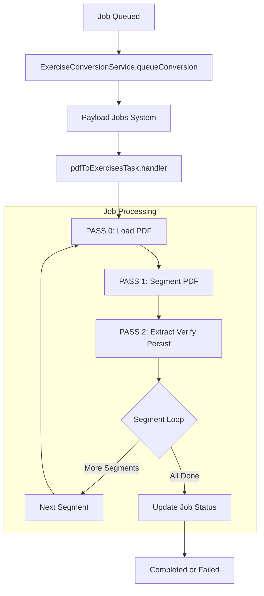
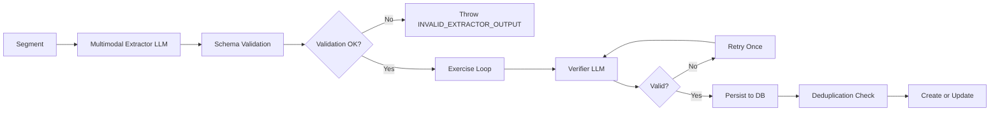

# PDF → Exercises Job Flow

## Overview

The PDF conversion job transforms uploaded PDF documents into structured exercises using LLM-based extraction and verification. It runs as an asynchronous Payload CMS job with progress tracking.

## Job Lifecycle



## Input Context

```typescript
interface JobContext {
  lessonId: string      // Target lesson for exercises
  sourceDocId: string   // Media document ID (PDF in Vercel Blob)
  tenantId: string      // Tenant context
}

interface JobInput {
  ctx: JobContext
  maxSegmentPages: number      // Pages per segment
  promptRefs: {
    extractorPromptId: string // Prompt for exercise extraction
    verifierPromptId: string  // Prompt for verification
  }
  promptSnapshot: {
    extractor: string         // Frozen extractor prompt
    verifier: string          // Frozen verifier prompt
  }
  promptSnapshotHash: {
    extractor: string         // SHA-256 of extractor prompt
    verifier: string          // SHA-256 of verifier prompt
  }
}
```

## Processing Passes

### PASS 0: PDF Loading & Validation

| Step | Description |
|------|-------------|
| Fetch media document | Retrieve Media record to get Vercel Blob URL |
| Load PDF buffer | Fetch PDF from Vercel Blob storage |
| Validate size | Reject if > 10MB (PDF_MAX_BYTES) |

### PASS 1: PDF Segmentation

| Step | Description |
|------|-------------|
| Get page count | Use pdf-lib for serverless-compatible counting |
| Create segments | Split into chunks of `maxSegmentPages` (default 3 pages) |

### PASS 2: Extract → Verify → Persist

For each segment:



#### Extractor Stage
- Sends PDF pages + extractor prompt to LLM (Gemini or OpenAI-compatible)
- Returns JSON array of exercises with title, blocks (rich_text/latex), orderInSegment
- Schema validated against `ExerciseExtractedSchema`
- Max exercises per segment enforced

#### Verifier Stage
- Each exercise validated independently
- Retry-once-then-skip logic (max 2 attempts)
- Invalid exercises logged but don't fail the job
- Progress tracked in `output.exercisesSkipped`

#### Persist Stage
- Compute contentHash for deduplication
- Query existing: `(lessonId, sourceDocId, contentHash)`
- If exists: update if new content is richer
- If new: create with metadata
- Handle concurrent duplicate key errors

## Output Schema

```typescript
interface JobOutput {
  segmentsTotal: number          // Total segments to process
  segmentsDone: number           // Successfully completed
  segmentsFailed: number         // Failed segments
  currentSegmentIndex: number    // 0-indexed position
  exercisesCreated: number       // New exercises
  exercisesDeduped: number      // Updated existing
  exercisesSkipped: number       // Failed verification
  errors: Array<{
    stage: string               // PASS0_EXTRACT | PASS2_EXTRACT | PASS2_VERIFY
    code: string               // Error code
    message: string            // Human-readable
    pageRange?: { start, end }
    skipped?: boolean
  }>
  segments: Array<{
    index: number
    pageStart: number
    pageEnd: number
    status: 'done' | 'failed'
    exercisesCreated: number
  }>
}
```

## Status Transitions

```
queued → running → completed
queued → running → failed
```

Lock mechanism: 5-minute timeout (`LOCK_TIMEOUT_MS`) prevents stale job claims.

## Key Behaviors

| Behavior | Description |
|----------|-------------|
| Idempotent creation | Same PDF + prompts = same exercises |
| Rich content wins | Update if new content has more blocks |
| Fail-safe | Verification failures skip, don't block job |
| Progress tracking | Real-time segment/exercise counts |
| Atomic status | Explicit MongoDB update on completion |

## External Dependencies

| Service | Purpose |
|---------|---------|
| Vercel Blob | PDF storage and retrieval |
| LLM Provider | Multimodal extraction (Gemini/OpenAI) |
| MongoDB | Job queue and exercise persistence |
| Payload CMS | Collections, hooks, access control |

## File References

| File | Purpose |
|------|---------|
| [`pdf-to-exercises-task.ts`](src/server/payload/jobs/pdf-to-exercises-task.ts) | Main job handler |
| [`exercise-conversion-service.ts`](src/server/payload/services/exercise-conversion-service.ts) | Queueing API |
| [`job-service.ts`](src/server/payload/services/job-service.ts) | Job status management |
| [`types.ts`](src/server/payload/jobs/types.ts) | Type definitions |
| [`constants.ts`](src/server/payload/jobs/constants.ts) | Configuration constants |
