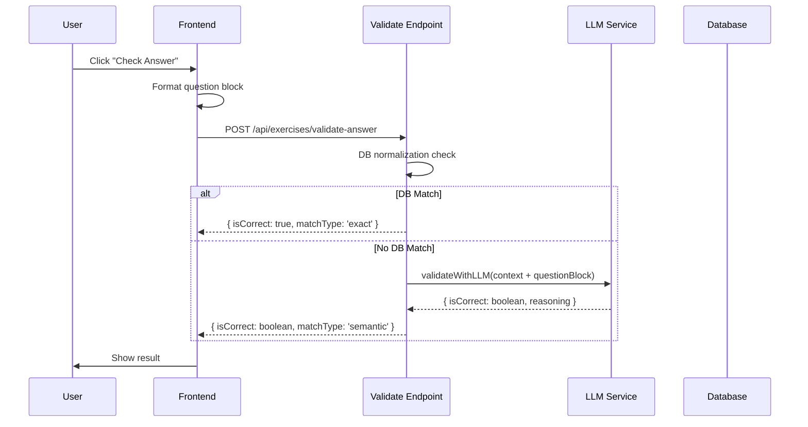

# Chat Messaging & Exercise Context: Architectural Analysis

**Date:** 2026-02-16
**Author:** Architect Mode
**Status:** Analysis Complete

---

## Executive Summary

This document provides a deep analysis of the current chat messaging flow for web exercises, identifies architectural gaps preventing smooth operation, and proposes concrete architectural improvements. The core issue is that the AI model lacks contextual awareness of specific exercises when answering questions, leading to suboptimal responses and answer validation failures.

---

## Current Architecture Overview

### 1. Chat Flow Architecture

```
Frontend (ChatInterface)
    │
    ├── useNotebookChat hook
    │   ├── sendMessage() / streamMessage()
    │   └── sendContextualHelp() ← Used for incorrect answer help
    │
    └── API Service (apiService.chat / chatStream)
         │
         └── POST /api/agent/chat
              │
              ├── Context Resolution
              │   ├── Priority: Lesson > Exercise > Chapter > Course
              │   └── Resolves to: lessons:{lessonId}
              │
              ├── Conversation Service
              │   ├── getOrCreateActiveConversation()
              │   └── fetch conversation history
              │
              ├── Prompt Composition
              │   ├── System Prompts (published)
              │   ├── Lesson/Course Prompt
              │   ├── Lesson/Course Context Text
              │   ├── Memories (vector search)
              │   └── Recent Messages (last 20)
              │
              └── LLM Call (exercise-chat-service)
                   └── Sends: systemPrompt + messages
```

**Key Files:**

- [`src/ui/web/chat/hooks/useNotebookChat.ts`](src/ui/web/chat/hooks/useNotebookChat.ts) - Frontend chat logic
- [`src/server/payload/endpoints/agent/chat.ts`](src/server/payload/endpoints/agent/chat.ts) - Main chat endpoint
- [`src/server/services/conversation-service.ts`](src/server/services/conversation-service.ts) - Conversation management
- [`src/infra/llm/context-policy.ts`](src/infra/llm/context-policy.ts) - Context Policy V1

### 2. Answer Validation Flow

```
Frontend (ExerciseRenderer)
    │
    ├── handleCheckAnswer()
    │   └── checkQuestionAnswer() → validateFreeResponseOnServer()
    │
    └── POST /api/exercises/validate-answer
         │
         ├── Step 1: DB Normalization
         │   └── matchAnswer() - string matching
         │
         └── Step 2: LLM Fallback (if no DB match)
              │
              └── validateWithLLM()
                   └── Sends:
                       ├── System: ANSWER_VALIDATION_PROMPT
                       └── User: questionText + acceptedAnswers + studentAnswer
```

**Key Files:**

- [`src/ui/web/exerciserenderer/utils/answerChecking.ts`](src/ui/web/exerciserenderer/utils/answerChecking.ts) - Frontend validation
- [`src/server/payload/endpoints/exercises/validate-answer.ts`](src/server/payload/endpoints/exercises/validate-answer.ts) - Validation endpoint
- [`src/infra/llm/services/answer-validation-service.ts`](src/infra/llm/services/answer-validation-service.ts) - LLM validation service
- [`src/infra/llm/prompts/answer-validation.ts`](src/infra/llm/prompts/answer-validation.ts) - Validation prompt

---

## Identified Problems

### Problem 1: Chat AI Lacks Exercise Context

**Current Behavior:**
When user asks a question in the chat while viewing an exercise:

- AI knows the lesson context (title, description, etc.)
- AI does NOT know the specific exercise content
- AI does NOT know the specific question being attempted
- AI does NOT have access to media or hints

**Impact:**

```
User: "How do I solve this problem?"
AI: "I'd need more context about your question."  ← Generic response
```

**Why This Happens:**

1. Chat context is scoped to `lessons:{lessonId}` (lesson-level)
2. Exercise content is NOT fetched during chat request
3. No mechanism to inject exercise-specific context

### Problem 2: Answer Validation LLM Has No Context

**Current Behavior:**
The [`validateWithLLM()`](src/infra/llm/services/answer-validation-service.ts:29) function only receives:

```typescript
{
  questionText: string,      // Just the prompt text
  acceptedAnswers: string[], // Array of accepted answers
  studentAnswer: string     // Student's answer
}
```

**Missing Information:**

- Full question block structure (type, variant, etc.)
- Media associated with the question
- Hints available for the question
- Solution/explanation content
- Exercise context (other blocks, topic, etc.)

**Impact:**

- LLM cannot understand complex question structures (tables, matching, geometry)
- LLM cannot reference visual aids (images, diagrams)
- LLM cannot provide context-aware hints or explanations

### Problem 3: No Mechanism to Inject Hidden Context

**Current Status:**
The [`Conversations`](src/server/payload/collections/Conversations.ts:142) collection has a `hidden` field:

```typescript
{
  name: 'hidden',
  type: 'checkbox',
  admin: {
    description: 'Hidden messages are persisted for LLM context but excluded from client responses'
  }
}
```

**However:**

- This field exists but is rarely/never used
- No pattern established for injecting exercise context
- No API or service to manage hidden context messages

---

## User's Secret Payload Idea: Evaluation

### Analysis of the Proposal

The user suggested adding "secret payload" into chat messages - hidden from UI but visible to LLM.

**Current Infrastructure Supports This:**

```typescript
// In Conversations collection (lines 180-188)
{
  name: 'hidden',
  type: 'checkbox',
  admin: {
    description: 'Hidden messages are persisted for LLM context but excluded from client responses'
  }
}
```

### Recommendation: PARTIAL - Enhanced Approach Needed

While the `hidden` field provides the mechanism, we need a more structured approach:

1. **Hidden messages should be structured**, not plain text
2. **Need clear lifecycle management** (when to inject, when to remove)
3. **Need type system** for context payloads
4. **Need access control** (what context can be injected)

---

## Proposed Architectural Improvements

### Solution 1: Exercise Context Injection System

Create a structured mechanism to inject exercise context into conversations.

#### A. New Context Payload Types

```typescript
// src/shared/chat-context/types.ts

export type ContextPayloadType =
  | 'exercise_init'
  | 'question_context'
  | 'media_attachment'
  | 'hint_available'
  | 'solution_available'

export interface ExerciseContextPayload {
  type: 'exercise_init'
  exerciseId: string
  exerciseTitle: string
  contentBlocks: ContentBlock[] // Full exercise content
  mediaMap: Record<string, MediaItem>
  hints: Array<{ questionId: string; hint: string }>
}

export interface QuestionContextPayload {
  type: 'question_context'
  questionId: string
  questionType: QuestionBlock['type']
  questionVariant?: string
  prompt: string
  acceptedAnswers: string[]
  mediaIds: string[]
  hints: string[]
  solution?: string
}

export interface ChatContextPayload {
  id: string
  type: ContextPayloadType
  timestamp: string
  data: ExerciseContextPayload | QuestionContextPayload
}
```

#### B. New Conversation Hook/Service

```typescript
// src/server/services/chat-context-injector.ts

export class ChatContextInjector {
  /**
   * Inject exercise context as hidden message
   * Called when user navigates to an exercise
   */
  async injectExerciseContext(
    conversationId: string,
    exerciseId: string,
    req: PayloadRequest,
  ): Promise<void>

  /**
   * Inject question context before user submits answer
   * Called from check answer flow
   */
  async injectQuestionContext(
    conversationId: string,
    question: QuestionBlock,
    req: PayloadRequest,
  ): Promise<void>

  /**
   * Clear stale context when exercise changes
   */
  async clearExerciseContext(
    conversationId: string,
    newExerciseId: string,
    req: PayloadRequest,
  ): Promise<void>
}
```

#### C. Integration Points

```
Exercise Page Load
    │
    └── useEffect()
        │
        ├── Fetch exercise content
        ├── Inject exercise_init context (hidden message)
        └── Send welcome message with exercise reference
```

### Solution 2: Enhanced Answer Validation Service

Modify [`validateWithLLM()`](src/infra/llm/services/answer-validation-service.ts:29) to receive full context.

#### A. Enhanced Input Interface

```typescript
// src/infra/llm/services/answer-validation-service.ts

export interface EnhancedLLMValidationInput {
  // Current fields
  questionText: string
  acceptedAnswers: string[]
  studentAnswer: string

  // NEW: Full context
  questionBlock: QuestionBlock // Full question block
  exerciseContext?: {
    exerciseId: string
    exerciseTitle: string
    lessonTitle: string
    previousBlocks: ContentBlock[]
    nextBlocks: ContentBlock[]
  }
  mediaItems?: Array<{
    mediaId: string
    url: string
    mimeType: string
    altText?: string
  }>
}
```

#### B. Enhanced System Prompt

```typescript
// src/infra/llm/prompts/answer-validation-enhanced.ts

export const ANSWER_VALIDATION_PROMPT_V2 = `You are an expert tutor grading student answers.

You have access to:
1. The full question structure (type, variant, options, etc.)
2. Associated media (images, diagrams, etc.)
3. Available hints and solutions
4. The exercise context (lesson topic, surrounding content)

Guidelines:
- Use visual information from media to understand the question
- Consider hints as hints the student could have received
- Be lenient with phrasing but strict with mathematical correctness
- Provide constructive feedback aligned with available hints

Output Format: Return ONLY valid JSON...
```

#### C. Integration with Frontend

```typescript
// In validateFreeResponseOnServer()
async function validateFreeResponseOnServer(
  question: QuestionFreeResponseBlock,
  studentAnswer: string,
  messages: AnswerErrorMessages,
  exerciseContext: ExerciseContext, // NEW PARAMETER
): Promise<CheckResult> {
  const response = await fetch('/api/exercises/validate-answer', {
    method: 'POST',
    headers: { 'Content-Type': 'application/json' },
    body: JSON.stringify({
      questionId: question.id,
      questionText: question.prompt.value,
      questionBlock: question, // Full block
      acceptedAnswers: question.answer.acceptedAnswers,
      studentAnswer,
      exerciseContext, // Full context
      mediaIds: question.prompt.mediaIds,
    }),
  })
  // ... rest unchanged
}
```

### Solution 3: Context-Aware Chat Prompts

Enhance the system prompt composition to include exercise-specific instructions.

#### A. New Prompt Resolver

```typescript
// src/infra/llm/prompt-resolvers/exercise-prompt-resolver.ts

export async function resolveExerciseSystemPrompt(
  payload: Payload,
  exerciseId: string,
  userId: string,
): Promise<ResolvedPrompt> {
  const exercise = await payload.findByID({
    collection: 'exercises',
    id: exerciseId,
    depth: 0,
  })

  // Generate exercise-specific system instruction
  const exerciseInstruction = generateExerciseInstruction(exercise)

  return {
    template: exerciseInstruction,
    source: 'exercise',
    metadata: {
      exerciseId,
      exerciseTitle: exercise.title,
    },
  }
}
```

#### B. Enhanced Context Policy

```typescript
// src/infra/llm/context-policy.ts (augmented)

export interface ExerciseContextComponents extends ContextComponents {
  exerciseContext: {
    exerciseId: string
    exerciseTitle: string
    currentQuestion?: string
    hintsAvailable: string[]
    mediaItems: MediaItem[]
  }
}

export function composeExercisePrompt(
  systemInstructions: string,
  components: ExerciseContextComponents,
): ComposedPrompt {
  // Add exercise context to system message
  const enhancedSystem =
    systemInstructions + '\n\n' + formatExerciseContext(components.exerciseContext)

  return composePrompt(enhancedSystem, components)
}
```

### Solution 4: API Enhancement for Context Injection

#### A. New Endpoint: POST /api/agent/chat/context

```typescript
// src/server/payload/endpoints/agent/chat/context-injection.ts

export async function injectChatContext(req: PayloadRequest) {
  const { conversationId, contextType, contextData } = await req.json()

  // Create hidden message with structured context
  await req.payload.create({
    collection: 'conversations',
    id: conversationId,
    data: {
      messages: [
        {
          role: 'assistant',
          content: JSON.stringify(contextData),
          timestamp: new Date().toISOString(),
          hidden: true, // Key: hidden from UI
          metadata: {
            type: contextType,
            injectedAt: new Date().toISOString(),
          },
        },
      ],
    },
    overrideAccess: true,
  })

  return Response.json({ success: true })
}
```

#### B. Frontend Hook

```typescript
// src/ui/web/chat/hooks/useChatContext.ts

export function useChatContext(conversationId: string) {
  const injectExerciseContext = useCallback(
    async (exercise: Exercise) => {
      await fetch('/api/agent/chat/context', {
        method: 'POST',
        body: JSON.stringify({
          conversationId,
          contextType: 'exercise_init',
          contextData: {
            exerciseId: exercise.id,
            title: exercise.title,
            content: exercise.content,
            mediaMap: exercise.mediaMap,
          },
        }),
      })
    },
    [conversationId],
  )

  return { injectExerciseContext }
}
```

---

## Implementation Roadmap

### Phase 1: Foundation (Week 1)

1. **Create context payload types**
   - File: `src/shared/chat-context/types.ts`
   - Define all context payload interfaces

2. **Add helper functions to conversation service**
   - `injectContextMessage()`
   - `clearContextMessages()`

3. **Update answer validation endpoint**
   - Accept enhanced input with full question block
   - Pass context to LLM service

### Phase 2: Core Implementation (Week 2)

1. **Modify frontend exercise renderer**
   - Pass full question block to validation
   - Include exercise context in API calls

2. **Enhance answer validation LLM service**
   - Update system prompt (V2)
   - Handle media attachments
   - Use question block structure

3. **Create chat context injection API**
   - `POST /api/agent/chat/context`
   - `DELETE /api/agent/chat/context/{conversationId}`

### Phase 3: Polish (Week 3)

1. **Integrate with exercise page**
   - Inject exercise context on page load
   - Inject question context on check answer

2. **Add context to chat prompts**
   - Modify prompt composition
   - Include exercise info in system message

3. **Testing & Optimization**
   - Test all question types
   - Optimize token usage
   - Add caching for exercise content

---

## Security Considerations

### Data Exposure

| Context          | Stored in DB | Sent to LLM | Visible in UI |
| ---------------- | ------------ | ----------- | ------------- |
| Exercise content | Yes          | Yes         | No (hidden)   |
| Hints            | Yes          | Yes         | No (hidden)   |
| Solutions        | Yes          | Yes         | No (hidden)   |
| Media URLs       | Yes          | Yes         | No (hidden)   |

### Mitigation Strategies

1. **Access Control**: Only inject context for exercises user has access to
2. **Audit Logging**: Log all context injections for debugging
3. **Rate Limiting**: Limit context injection frequency
4. **Content Sanitization**: Validate context data before injection

---

## Alternative Approaches Considered

### Option A: Direct LLM Context Injection (User's Suggestion)

**Pros:**

- Simple to implement
- Leverages existing `hidden` field
- No schema changes needed

**Cons:**

- No structure to context
- Hard to manage lifecycle
- Difficult to type/sanitize

**Verdict:** Use as quick win, but implement structured approach for long term

### Option B: Vector Search for Exercise Content

**Pros:**

- Semantic search for relevant content
- No manual context injection

**Cons:**

- Adds latency
- Requires embedding model
- May miss critical context

**Verdict:** Consider as future enhancement, not replacement

### Option C: Dedicated Exercise Context API

**Pros:**

- Clean separation of concerns
- Reusable across features

**Cons:**

- More infrastructure
- Overkill for current needs

**Verdict:** Implement as part of proposed solution

---

## Recommendations

### Primary Recommendation

**Implement Solution 1 (Exercise Context Injection) + Solution 2 (Enhanced Answer Validation)**

This provides:

- Structured context payloads
- Full exercise awareness for chat AI
- Enhanced answer validation with media support
- Reusable infrastructure

### Secondary Recommendation

**Leverage existing `hidden` field in Conversations**

The infrastructure already supports hidden messages. Use it with:

- Structured JSON payloads
- Clear lifecycle management
- Type-safe context types

### Immediate Actions

1. ✅ Review this analysis document
2. ✅ Approve proposed architecture
3. ⬜ Create detailed implementation specs
4. ⬜ Begin Phase 1 implementation

---

## Appendix: Mermaid Diagrams

### Current Flow

```mermaid
graph TD
    A[User in Exercise] --> B[Chat Interface]
    B --> C[POST /api/agent/chat]
    C --> D[Resolve Context: lessons:{lessonId}]
    D --> E[Fetch Conversation]
    E --> F[Compose Prompt]
    F --> G[Lesson Context Only]
    F --> H[Course Context]
    F --> I[Memories]
    F --> J[Recent Messages]
    G --> K[LLM Call]
    H --> K
    I --> K
    J --> K
    K --> L[Generic AI Response]
```

### Proposed Flow

```mermaid
graph TD
    A[User in Exercise] --> B[Inject Exercise Context]
    B --> C[Hidden Message: exercise_init]
    D[User Asks Question] --> E[Chat Interface]
    E --> F[POST /api/agent/chat]
    F --> G[Resolve Context: lessons:{lessonId}]
    G --> H[Fetch Conversation + Hidden Context]
    H --> I[Compose Enhanced Prompt]
    I --> J[Lesson Context]
    I --> K[Course Context]
    I --> L[Memories]
    I --> M[Recent Messages]
    I --> N[Exercise Context: Full Content + Media]
    J --> O[LLM Call]
    K --> O
    L --> O
    M --> O
    N --> O
    O --> P[Context-Aware AI Response]
```

### Answer Validation Flow



---

## References

- Conversations Collection: [`src/server/payload/collections/Conversations.ts`](src/server/payload/collections/Conversations.ts)
- Chat Endpoint: [`src/server/payload/endpoints/agent/chat.ts`](src/server/payload/endpoints/agent/chat.ts)
- Answer Validation: [`src/server/payload/endpoints/exercises/validate-answer.ts`](src/server/payload/endpoints/exercises/validate-answer.ts)
- Exercise Content Types: [`src/shared/exercise-content/types.ts`](src/shared/exercise-content/types.ts)
- Context Policy: [`src/infra/llm/context-policy.ts`](src/infra/llm/context-policy.ts)
